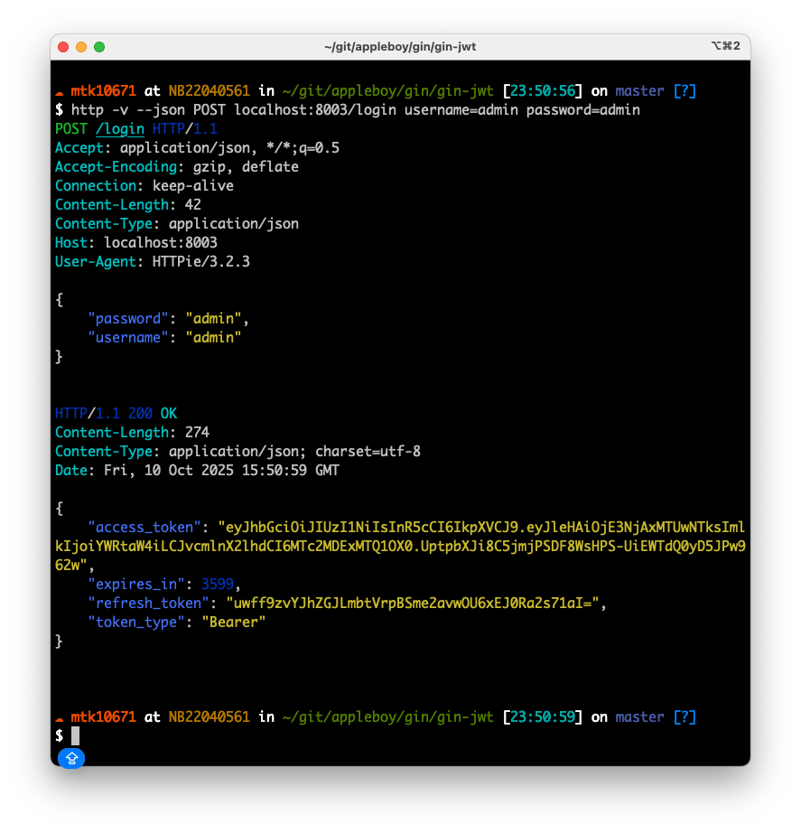

# Gin JWT Middleware

[English](README.md) | [繁體中文](README.zh-TW.md) | [简体中文](README.zh-CN.md)

[](https://github.com/appleboy/gin-jwt/actions/workflows/go.yml)
[](https://github.com/appleboy/gin-jwt/actions/workflows/trivy-scan.yml)
[](https://github.com/appleboy/gin-jwt/releases)
[](https://godoc.org/github.com/appleboy/gin-jwt)
[](https://goreportcard.com/report/github.com/appleboy/gin-jwt)
[](https://codecov.io/gh/appleboy/gin-jwt)
[](https://sourcegraph.com/github.com/appleboy/gin-jwt?badge)

A powerful and flexible JWT authentication middleware for the [Gin](https://github.com/gin-gonic/gin) web framework, built on top of [golang-jwt/jwt](https://github.com/golang-jwt/jwt).
Easily add login, token refresh, and authorization to your Gin applications.

---

## Table of Contents

- [Gin JWT Middleware](#gin-jwt-middleware)
  - [Table of Contents](#table-of-contents)
  - [Features](#features)
  - [Security Notice](#security-notice)
    - [🔒 Critical Security Requirements](#-critical-security-requirements)
    - [🛡️ Production Security Checklist](#️-production-security-checklist)
    - [🔄 OAuth 2.0 Security Standards](#-oauth-20-security-standards)
    - [💡 Secure Configuration Example](#-secure-configuration-example)
  - [Installation](#installation)
  - [Quick Start Example](#quick-start-example)
  - [Complete Examples](#complete-examples)
    - [🔑 Basic Authentication](#-basic-authentication)
    - [🌐 OAuth SSO Integration](#-oauth-sso-integration)
    - [🔐 Token Generator](#-token-generator)
    - [🗄️ Redis Store](#️-redis-store)
    - [🛡️ Authorization](#️-authorization)
  - [Configuration](#configuration)
  - [Supporting Multiple JWT Providers](#supporting-multiple-jwt-providers)
    - [Use Cases](#use-cases)
    - [Solution: Dynamic Key Function](#solution-dynamic-key-function)
      - [Why This Works](#why-this-works)
    - [Implementation Strategy](#implementation-strategy)
      - [Step 1: Create a Unified Middleware](#step-1-create-a-unified-middleware)
      - [Step 2: Helper Functions](#step-2-helper-functions)
      - [Step 3: Route Setup](#step-3-route-setup)
    - [Complete Azure AD Integration Example](#complete-azure-ad-integration-example)
    - [Alternative Approach: Custom Wrapper Middleware](#alternative-approach-custom-wrapper-middleware)
    - [Key Considerations](#key-considerations)
    - [Testing Multi-Provider Setup](#testing-multi-provider-setup)
    - [Common Issues and Solutions](#common-issues-and-solutions)
    - [Additional Resources](#additional-resources)
  - [Token Generator (Direct Token Creation)](#token-generator-direct-token-creation)
    - [Basic Usage](#basic-usage)
    - [Token Structure](#token-structure)
    - [Refresh Token Management](#refresh-token-management)
  - [Redis Store Configuration](#redis-store-configuration)
    - [Redis Features](#redis-features)
    - [Redis Usage Methods](#redis-usage-methods)
      - [Using Functional Options Pattern (Recommended)](#using-functional-options-pattern-recommended)
      - [Available Options](#available-options)
    - [Configuration Options](#configuration-options)
      - [RedisConfig](#redisconfig)
    - [Fallback Behavior](#fallback-behavior)
    - [Example with Redis](#example-with-redis)
  - [Demo](#demo)
    - [Login](#login)
    - [Refresh Token](#refresh-token)
    - [Hello World](#hello-world)
    - [Authorization Example](#authorization-example)
  - [Understanding the Authorizer](#understanding-the-authorizer)
    - [How Authorizer Works](#how-authorizer-works)
    - [Authorizer Function Signature](#authorizer-function-signature)
    - [Basic Usage Examples](#basic-usage-examples)
      - [Example 1: Role-Based Authorization](#example-1-role-based-authorization)
      - [Example 2: Path-Based Authorization](#example-2-path-based-authorization)
      - [Example 3: Method and Path Based Authorization](#example-3-method-and-path-based-authorization)
    - [Setting Up Different Authorization for Different Routes](#setting-up-different-authorization-for-different-routes)
      - [Method 1: Multiple Middleware Instances](#method-1-multiple-middleware-instances)
      - [Method 2: Single Authorizer with Path Logic](#method-2-single-authorizer-with-path-logic)
    - [Advanced Authorization Patterns](#advanced-authorization-patterns)
      - [Using Claims for Fine-Grained Control](#using-claims-for-fine-grained-control)
    - [Common Patterns and Best Practices](#common-patterns-and-best-practices)
    - [Complete Example](#complete-example)
    - [Logout](#logout)
  - [Cookie Token](#cookie-token)
    - [Refresh Token Cookie Support](#refresh-token-cookie-support)
    - [Login request flow (using the LoginHandler)](#login-request-flow-using-the-loginhandler)
    - [Subsequent requests on endpoints requiring jwt token (using MiddlewareFunc)](#subsequent-requests-on-endpoints-requiring-jwt-token-using-middlewarefunc)
    - [Logout Request flow (using LogoutHandler)](#logout-request-flow-using-logouthandler)
    - [Refresh Request flow (using RefreshHandler)](#refresh-request-flow-using-refreshhandler)
    - [Failures with logging in, bad tokens, or lacking privileges](#failures-with-logging-in-bad-tokens-or-lacking-privileges)

---

## Features

- 🔒 Simple JWT authentication for Gin
- 🔁 Built-in login, refresh, and logout handlers
- 🛡️ Customizable authentication, authorization, and claims
- 🍪 Cookie and header token support
- 📝 Easy integration and clear API
- 🔐 RFC 6749 compliant refresh tokens (OAuth 2.0 standard)
- 🗄️ Pluggable refresh token storage (in-memory, Redis with client-side caching)
- 🏭 Direct token generation without HTTP middleware
- 📦 Structured Token type with metadata

---

## Security Notice

### 🔒 Critical Security Requirements

> **⚠️ JWT Secret Security**
>
> - **Minimum Requirements:** Use secrets of at least **256 bits (32 bytes)** in length
> - **Never use:** Simple passwords, dictionary words, or predictable patterns
> - **Recommended:** Generate cryptographically secure random secrets or use `RS256` algorithm
> - **Storage:** Store secrets in environment variables, never hardcode in source code
> - **Vulnerability:** Weak secrets are vulnerable to brute-force attacks ([jwt-cracker](https://github.com/lmammino/jwt-cracker))

### 🛡️ Production Security Checklist

- ✅ **HTTPS Only:** Always use HTTPS in production environments
- ✅ **Strong Secrets:** Minimum 256-bit randomly generated secrets
- ✅ **Token Expiry:** Set appropriate timeout values (recommended: 15-60 minutes for access tokens)
- ✅ **Secure Cookies:** Enable `SecureCookie`, `CookieHTTPOnly`, and appropriate `SameSite` settings
- ✅ **Environment Variables:** Store sensitive configuration in environment variables
- ✅ **Input Validation:** Validate all authentication inputs thoroughly

### 🔄 OAuth 2.0 Security Standards

This library follows **RFC 6749 OAuth 2.0** security standards:

- **Separate Tokens:** Uses distinct opaque refresh tokens (not JWT) for enhanced security
- **Server-Side Storage:** Refresh tokens are stored and validated server-side
- **Token Rotation:** Refresh tokens are automatically rotated on each use
- **Improved Security:** Prevents JWT refresh token vulnerabilities and replay attacks

### 💡 Secure Configuration Example

```go
// ❌ BAD: Weak secret, insecure settings
authMiddleware := &jwt.GinJWTMiddleware{
    Key:         []byte("weak"),           // Too short!
    Timeout:     time.Hour * 24,          // Too long!
    SecureCookie: false,                  // Insecure in production!
}

// ✅ GOOD: Strong security configuration
authMiddleware := &jwt.GinJWTMiddleware{
    Key:            []byte(os.Getenv("JWT_SECRET")), // From environment
    Timeout:        time.Minute * 15,                // Short-lived access tokens
    MaxRefresh:     time.Hour * 24 * 7,             // 1 week refresh validity
    SecureCookie:   true,                           // HTTPS only
    CookieHTTPOnly: true,                           // Prevent XSS
    CookieSameSite: http.SameSiteStrictMode,        // CSRF protection
    SendCookie:     true,                           // Enable secure cookies
}
```

---

## Installation

Requires Go 1.24+

```bash
go get -u github.com/appleboy/gin-jwt/v3
```

```go
import "github.com/appleboy/gin-jwt/v3"
```

---

## Quick Start Example

Please see [the example file](_example/basic/server.go) and you can use `ExtractClaims` to fetch user data.

```go
package main

import (
  "log"
  "net/http"
  "os"
  "time"

  jwt "github.com/appleboy/gin-jwt/v3"
  "github.com/gin-gonic/gin"
  "github.com/golang-jwt/jwt/v5"
)

type login struct {
  Username string `form:"username" json:"username" binding:"required"`
  Password string `form:"password" json:"password" binding:"required"`
}

var (
  identityKey = "id"
  port        string
)

// User demo
type User struct {
  UserName  string
  FirstName string
  LastName  string
}

func init() {
  port = os.Getenv("PORT")
  if port == "" {
    port = "8000"
  }
}

func main() {
  engine := gin.Default()
  // the jwt middleware
  authMiddleware, err := jwt.New(initParams())
  if err != nil {
    log.Fatal("JWT Error:" + err.Error())
  }

  // initialize middleware
  errInit := authMiddleware.MiddlewareInit()
  if errInit != nil {
    log.Fatal("authMiddleware.MiddlewareInit() Error:" + errInit.Error())
  }

  // register route
  registerRoute(engine, authMiddleware)

  // start http server
  if err = http.ListenAndServe(":"+port, engine); err != nil {
    log.Fatal(err)
  }
}

func registerRoute(r *gin.Engine, handle *jwt.GinJWTMiddleware) {
  // Public routes
  r.POST("/login", handle.LoginHandler)
  r.POST("/refresh", handle.RefreshHandler) // RFC 6749 compliant refresh endpoint

  r.NoRoute(handle.MiddlewareFunc(), handleNoRoute())

  // Protected routes
  auth := r.Group("/auth", handle.MiddlewareFunc())
  auth.GET("/hello", helloHandler)
  auth.POST("/logout", handle.LogoutHandler) // Logout with refresh token revocation
}

func initParams() *jwt.GinJWTMiddleware {
  return &jwt.GinJWTMiddleware{
    Realm:       "test zone",
    Key:         []byte("secret key"),
    Timeout:     time.Hour,
    MaxRefresh:  time.Hour,
    IdentityKey: identityKey,
    PayloadFunc: payloadFunc(),

    IdentityHandler: identityHandler(),
    Authenticator:   authenticator(),
    Authorizer:      authorizer(),
    Unauthorized:    unauthorized(),
    LogoutResponse:  logoutResponse(),
    TokenLookup:     "header: Authorization, query: token, cookie: jwt",
    // TokenLookup: "query:token",
    // TokenLookup: "cookie:token",
    TokenHeadName: "Bearer",
    TimeFunc:      time.Now,
  }
}

func payloadFunc() func(data any) jwt.MapClaims {
  return func(data any) jwt.MapClaims {
    if v, ok := data.(*User); ok {
      return jwt.MapClaims{
        identityKey: v.UserName,
      }
    }
    return jwt.MapClaims{}
  }
}

func identityHandler() func(c *gin.Context) any {
  return func(c *gin.Context) any {
    claims := jwt.ExtractClaims(c)
    return &User{
      UserName: claims[identityKey].(string),
    }
  }
}

func authenticator() func(c *gin.Context) (any, error) {
  return func(c *gin.Context) (any, error) {
    var loginVals login
    if err := c.ShouldBind(&loginVals); err != nil {
      return "", jwt.ErrMissingLoginValues
    }
    userID := loginVals.Username
    password := loginVals.Password

    if (userID == "admin" && password == "admin") || (userID == "test" && password == "test") {
      return &User{
        UserName:  userID,
        LastName:  "Bo-Yi",
        FirstName: "Wu",
      }, nil
    }
    return nil, jwt.ErrFailedAuthentication
  }
}

func authorizer() func(c *gin.Context, data any) bool {
  return func(c *gin.Context, data any) bool {
    if v, ok := data.(*User); ok && v.UserName == "admin" {
      return true
    }
    return false
  }
}

func unauthorized() func(c *gin.Context, code int, message string) {
  return func(c *gin.Context, code int, message string) {
    c.JSON(code, gin.H{
      "code":    code,
      "message": message,
    })
  }
}

func logoutResponse() func(c *gin.Context) {
  return func(c *gin.Context) {
    // This demonstrates that claims are now accessible during logout
    claims := jwt.ExtractClaims(c)
    user, exists := c.Get(identityKey)

    response := gin.H{
      "code":    http.StatusOK,
      "message": "Successfully logged out",
    }

    // Show that we can access user information during logout
    if len(claims) > 0 {
      response["logged_out_user"] = claims[identityKey]
    }
    if exists {
      response["user_info"] = user.(*User).UserName
    }

    c.JSON(http.StatusOK, response)
  }
}

func handleNoRoute() func(c *gin.Context) {
  return func(c *gin.Context) {
    c.JSON(404, gin.H{"code": "PAGE_NOT_FOUND", "message": "Page not found"})
  }
}

func helloHandler(c *gin.Context) {
  claims := jwt.ExtractClaims(c)
  user, _ := c.Get(identityKey)
  c.JSON(200, gin.H{
    "userID":   claims[identityKey],
    "userName": user.(*User).UserName,
    "text":     "Hello World.",
  })
}

```

---

## Complete Examples

This repository provides several complete example implementations demonstrating different use cases:

### 🔑 [Basic Authentication](_example/basic/)

The basic example showing fundamental JWT authentication with login, protected routes, and token validation.

### 🌐 [OAuth SSO Integration](_example/oauth_sso/)

**OAuth 2.0 Single Sign-On** example supporting multiple identity providers (Google, GitHub):

- OAuth 2.0 Authorization Code Flow
- CSRF protection with state tokens
- **Dual authentication support**: httpOnly cookies + Authorization headers
- Secure token delivery for both browser and mobile apps
- Interactive demo page included

### 🔐 [Token Generator](_example/token_generator/)

Direct token generation without HTTP middleware, perfect for:

- Programmatic authentication
- Service-to-service communication
- Testing authenticated endpoints
- Custom authentication flows

### 🗄️ [Redis Store](_example/redis_simple/)

Demonstrates Redis integration for refresh token storage with:

- Client-side caching for improved performance
- Automatic fallback to in-memory store
- Production-ready configuration examples

### 🛡️ [Authorization](_example/authorization/)

Advanced authorization patterns including:

- Role-based access control
- Path-based authorization
- Multiple middleware instances
- Fine-grained permission control

---

## Configuration

The `GinJWTMiddleware` struct provides the following configuration options:

| Option                 | Type                                             | Required | Default                  | Description                                                                                           |
| ---------------------- | ------------------------------------------------ | -------- | ------------------------ | ----------------------------------------------------------------------------------------------------- |
| Realm                  | `string`                                         | No       | `"gin jwt"`              | Realm name to display to the user.                                                                    |
| SigningAlgorithm       | `string`                                         | No       | `"HS256"`                | Signing algorithm (HS256, HS384, HS512, RS256, RS384, RS512).                                         |
| Key                    | `[]byte`                                         | Yes      | -                        | Secret key used for signing.                                                                          |
| Timeout                | `time.Duration`                                  | No       | `time.Hour`              | Duration that a jwt token is valid.                                                                   |
| MaxRefresh             | `time.Duration`                                  | No       | `0`                      | Duration that a refresh token is valid.                                                               |
| Authenticator          | `func(c *gin.Context) (any, error)`              | Yes      | -                        | Callback to authenticate the user. Returns user data.                                                 |
| Authorizer             | `func(c *gin.Context, data any) bool`            | No       | `true`                   | Callback to authorize the authenticated user.                                                         |
| PayloadFunc            | `func(data any) jwt.MapClaims`                   | No       | -                        | Callback to add additional payload data to the token.                                                 |
| Unauthorized           | `func(c *gin.Context, code int, message string)` | No       | -                        | Callback for unauthorized requests.                                                                   |
| LoginResponse          | `func(c *gin.Context, token *core.Token)`        | No       | -                        | Callback for successful login response.                                                               |
| LogoutResponse         | `func(c *gin.Context)`                           | No       | -                        | Callback for successful logout response.                                                              |
| RefreshResponse        | `func(c *gin.Context, token *core.Token)`        | No       | -                        | Callback for successful refresh response.                                                             |
| IdentityHandler        | `func(*gin.Context) any`                         | No       | -                        | Callback to retrieve identity from claims.                                                            |
| IdentityKey            | `string`                                         | No       | `"identity"`             | Key used to store identity in claims.                                                                 |
| TokenLookup            | `string`                                         | No       | `"header:Authorization"` | Source to extract token from (header, query, cookie).                                                 |
| TokenHeadName          | `string`                                         | No       | `"Bearer"`               | Header name prefix.                                                                                   |
| TimeFunc               | `func() time.Time`                               | No       | `time.Now`               | Function to provide current time.                                                                     |
| PrivKeyFile            | `string`                                         | No       | -                        | Path to private key file (for RS algorithms).                                                         |
| PubKeyFile             | `string`                                         | No       | -                        | Path to public key file (for RS algorithms).                                                          |
| SendCookie             | `bool`                                           | No       | `false`                  | Whether to send token as a cookie.                                                                    |
| CookieMaxAge           | `time.Duration`                                  | No       | `Timeout`                | Duration that the cookie is valid.                                                                    |
| SecureCookie           | `bool`                                           | No       | `false`                  | Whether to use secure cookies for access token (HTTPS only). Refresh token cookies are always secure. |
| CookieHTTPOnly         | `bool`                                           | No       | `false`                  | Whether to use HTTPOnly cookies.                                                                      |
| CookieDomain           | `string`                                         | No       | -                        | Domain for the cookie.                                                                                |
| CookieName             | `string`                                         | No       | `"jwt"`                  | Name of the cookie.                                                                                   |
| RefreshTokenCookieName | `string`                                         | No       | `"refresh_token"`        | Name of the refresh token cookie.                                                                     |
| CookieSameSite         | `http.SameSite`                                  | No       | -                        | SameSite attribute for the cookie.                                                                    |
| SendAuthorization      | `bool`                                           | No       | `false`                  | Whether to return authorization header for every request.                                             |
| DisabledAbort          | `bool`                                           | No       | `false`                  | Disable abort() of context.                                                                           |
| ParseOptions           | `[]jwt.ParserOption`                             | No       | -                        | Options for parsing the JWT.                                                                          |

---

## Supporting Multiple JWT Providers

In some scenarios, you may need to accept JWT tokens from multiple sources, such as your own authentication system and external identity providers like Azure AD, Auth0, or other OAuth 2.0 providers. This section explains how to implement multi-provider token validation using the `KeyFunc` callback.

### Use Cases

- 🔐 **Hybrid Authentication**: Support both internal and external authentication
- 🌐 **Third-Party Integration**: Accept tokens from Azure AD, Google, Auth0, etc.
- 🔄 **Migration Scenarios**: Gradually migrate from one auth system to another
- 🏢 **Enterprise SSO**: Support enterprise Single Sign-On alongside regular auth

### Solution: Dynamic Key Function

The recommended approach is to use a **single middleware with a dynamic `KeyFunc`** that determines the appropriate validation method based on token properties (such as the issuer claim).

#### Why This Works

The `KeyFunc` callback (line 41 in auth_jwt.go:41) is designed for exactly this purpose. It allows you to:

- Inspect the token before validation
- Choose the correct signing key/method dynamically
- Avoid the abort issue when chaining multiple middlewares

### Implementation Strategy

#### Step 1: Create a Unified Middleware

```go
package main

import (
    "errors"
    "fmt"
    "strings"
    "time"

    jwt "github.com/appleboy/gin-jwt/v3"
    "github.com/gin-gonic/gin"
    "github.com/golang-jwt/jwt/v5"
)

func createMultiProviderAuthMiddleware() (*jwt.GinJWTMiddleware, error) {
    // Your own JWT secret
    ownSecret := []byte("your-secret-key")

    // Azure AD public keys (fetched from JWKS endpoint)
    azurePublicKeys := getAzurePublicKeys()

    return jwt.New(&jwt.GinJWTMiddleware{
        Realm:       "multi-provider-api",
        Key:         ownSecret, // Default key (required but may not be used)
        IdentityKey: "sub",
        Timeout:     time.Hour,

        // Dynamic key function - the core of multi-provider support
        KeyFunc: func(token *jwt.Token) (interface{}, error) {
            // Extract claims to determine token source
            claims, ok := token.Claims.(jwt.MapClaims)
            if !ok {
                return nil, errors.New("invalid claims type")
            }

            // Check the issuer claim to identify the token source
            issuer, _ := claims["iss"].(string)

            // Route 1: Azure AD tokens
            if isAzureADIssuer(issuer) {
                // Validate algorithm
                if token.Method.Alg() != "RS256" {
                    return nil, fmt.Errorf("unexpected signing method: %v", token.Header["alg"])
                }

                // Get key ID from token header
                keyID, ok := token.Header["kid"].(string)
                if !ok {
                    return nil, errors.New("missing key ID in Azure AD token header")
                }

                // Look up the public key
                if key, found := azurePublicKeys[keyID]; found {
                    return key, nil
                }
                return nil, fmt.Errorf("unknown Azure AD key ID: %s", keyID)
            }

            // Route 2: Your own tokens
            // Validate that the signing method matches your configuration
            if token.Method.Alg() != "HS256" {
                return nil, fmt.Errorf("unexpected signing method: %v", token.Header["alg"])
            }

            return ownSecret, nil
        },

        // Handle different identity formats from different providers
        IdentityHandler: func(c *gin.Context) interface{} {
            claims := jwt.ExtractClaims(c)

            // Try standard "sub" claim (used by most OAuth providers)
            if sub, ok := claims["sub"].(string); ok {
                return sub
            }

            // Fallback to custom "identity" claim
            if identity, ok := claims["identity"].(string); ok {
                return identity
            }

            return nil
        },

        // Optional: Provider-specific authorization
        Authorizer: func(c *gin.Context, data interface{}) bool {
            claims := jwt.ExtractClaims(c)
            issuer, _ := claims["iss"].(string)

            // Azure AD specific authorization
            if isAzureADIssuer(issuer) {
                return authorizeAzureADUser(claims, c)
            }

            // Your own token authorization
            return authorizeOwnUser(claims, c)
        },

        // Optional: Custom error messages for different providers
        HTTPStatusMessageFunc: func(c *gin.Context, e error) string {
            if strings.Contains(e.Error(), "Azure AD") {
                return "Azure AD token validation failed: " + e.Error()
            }
            return e.Error()
        },
    })
}
```

#### Step 2: Helper Functions

```go
// Check if issuer is from Azure AD
func isAzureADIssuer(issuer string) bool {
    // Azure AD issuers look like:
    // https://login.microsoftonline.com/{tenant}/v2.0
    // https://sts.windows.net/{tenant}/
    return strings.Contains(issuer, "login.microsoftonline.com") ||
           strings.Contains(issuer, "sts.windows.net")
}

// Fetch and cache Azure AD public keys from JWKS endpoint
func getAzurePublicKeys() map[string]interface{} {
    // Implementation: Fetch from Azure AD JWKS endpoint
    // https://login.microsoftonline.com/common/discovery/v2.0/keys
    // or tenant-specific: https://login.microsoftonline.com/{tenant}/discovery/v2.0/keys

    // Use a library like github.com/lestrrat-go/jwx/v2/jwk for JWKS parsing
    // Implement caching to avoid fetching on every request

    keys := make(map[string]interface{})

    // Example structure (you need to implement the actual fetching):
    // jwkSet, err := jwk.Fetch(context.Background(),
    //     "https://login.microsoftonline.com/common/discovery/v2.0/keys")
    // if err != nil {
    //     log.Printf("Failed to fetch Azure AD keys: %v", err)
    //     return keys
    // }
    //
    // for it := jwkSet.Iterate(context.Background()); it.Next(context.Background()); {
    //     pair := it.Pair()
    //     key := pair.Value.(jwk.Key)
    //
    //     var rawKey interface{}
    //     if err := key.Raw(&rawKey); err == nil {
    //         keys[key.KeyID()] = rawKey
    //     }
    // }

    return keys
}

// Azure AD specific authorization
func authorizeAzureADUser(claims jwt.MapClaims, c *gin.Context) bool {
    // Check Azure AD specific claims

    // Example: Check roles claim
    if roles, ok := claims["roles"].([]interface{}); ok {
        for _, role := range roles {
            if role.(string) == "Admin" || role.(string) == "User" {
                return true
            }
        }
    }

    // Example: Check groups claim
    if groups, ok := claims["groups"].([]interface{}); ok {
        allowedGroups := []string{"group-id-1", "group-id-2"}
        for _, group := range groups {
            for _, allowed := range allowedGroups {
                if group.(string) == allowed {
                    return true
                }
            }
        }
    }

    // Example: Check app roles
    if appRoles, ok := claims["app_role"].(string); ok {
        if appRoles == "User.Read" || appRoles == "Admin.All" {
            return true
        }
    }

    return false
}

// Your own token authorization
func authorizeOwnUser(claims jwt.MapClaims, c *gin.Context) bool {
    // Your custom authorization logic
    if role, ok := claims["role"].(string); ok {
        return role == "admin" || role == "user"
    }
    return true
}
```

#### Step 3: Route Setup

```go
func main() {
    r := gin.Default()

    // Initialize multi-provider middleware
    authMiddleware, err := createMultiProviderAuthMiddleware()
    if err != nil {
        log.Fatal("JWT Error: " + err.Error())
    }

    if err := authMiddleware.MiddlewareInit(); err != nil {
        log.Fatal("Middleware Init Error: " + err.Error())
    }

    // Public routes
    r.POST("/login", authMiddleware.LoginHandler) // For your own auth
    r.POST("/refresh", authMiddleware.RefreshHandler)

    // Protected routes - accepts tokens from any configured provider
    auth := r.Group("/api")
    auth.Use(authMiddleware.MiddlewareFunc())
    {
        auth.GET("/profile", func(c *gin.Context) {
            claims := jwt.ExtractClaims(c)
            issuer := claims["iss"].(string)

            c.JSON(200, gin.H{
                "message": "Success",
                "user_id": claims["sub"],
                "issuer":  issuer,
                "source":  determineTokenSource(issuer),
            })
        })
    }

    r.Run(":8080")
}

func determineTokenSource(issuer string) string {
    if isAzureADIssuer(issuer) {
        return "Azure AD"
    }
    return "Internal"
}
```

### Complete Azure AD Integration Example

For a production-ready Azure AD integration, you'll need to:

**Fetch JWKS Keys Dynamically**:

```go
import (
    "context"
    "crypto/rsa"
    "sync"
    "time"

    "github.com/lestrrat-go/jwx/v2/jwk"
)

type AzureADKeyProvider struct {
    jwksURL    string
    keys       map[string]*rsa.PublicKey
    mutex      sync.RWMutex
    lastUpdate time.Time
}

func NewAzureADKeyProvider(tenantID string) *AzureADKeyProvider {
    provider := &AzureADKeyProvider{
        jwksURL: fmt.Sprintf(
            "https://login.microsoftonline.com/%s/discovery/v2.0/keys",
            tenantID,
        ),
        keys: make(map[string]*rsa.PublicKey),
    }

    // Initial fetch
    provider.RefreshKeys()

    // Refresh keys every hour
    go func() {
        ticker := time.NewTicker(1 * time.Hour)
        defer ticker.Stop()
        for range ticker.C {
            provider.RefreshKeys()
        }
    }()

    return provider
}

func (p *AzureADKeyProvider) RefreshKeys() error {
    ctx, cancel := context.WithTimeout(context.Background(), 10*time.Second)
    defer cancel()

    set, err := jwk.Fetch(ctx, p.jwksURL)
    if err != nil {
        return fmt.Errorf("failed to fetch JWKS: %w", err)
    }

    newKeys := make(map[string]*rsa.PublicKey)

    for it := set.Keys(ctx); it.Next(ctx); {
        key := it.Pair().Value.(jwk.Key)

        var rawKey interface{}
        if err := key.Raw(&rawKey); err != nil {
            continue
        }

        if rsaKey, ok := rawKey.(*rsa.PublicKey); ok {
            newKeys[key.KeyID()] = rsaKey
        }
    }

    p.mutex.Lock()
    p.keys = newKeys
    p.lastUpdate = time.Now()
    p.mutex.Unlock()

    return nil
}

func (p *AzureADKeyProvider) GetKey(keyID string) (*rsa.PublicKey, bool) {
    p.mutex.RLock()
    defer p.mutex.RUnlock()

    key, found := p.keys[keyID]
    return key, found
}
```

**Validate Azure AD Specific Claims**:

```go
func validateAzureADClaims(claims jwt.MapClaims) error {
    // Validate issuer
    iss, ok := claims["iss"].(string)
    if !ok || !isAzureADIssuer(iss) {
        return errors.New("invalid Azure AD issuer")
    }

    // Validate audience (your application ID)
    aud, ok := claims["aud"].(string)
    if !ok || aud != "your-app-client-id" {
        return errors.New("invalid audience")
    }

    // Validate tenant (optional, for single-tenant apps)
    tid, ok := claims["tid"].(string)
    if !ok || tid != "your-tenant-id" {
        return errors.New("invalid tenant")
    }

    return nil
}
```

### Alternative Approach: Custom Wrapper Middleware

If you need even more control or want to keep providers completely separate:

```go
func MultiAuthMiddleware(
    ownAuth *jwt.GinJWTMiddleware,
    externalAuth *jwt.GinJWTMiddleware,
) gin.HandlerFunc {
    return func(c *gin.Context) {
        // Try own authentication first
        ownAuth.DisabledAbort = true
        ownAuth.MiddlewareFunc()(c)

        // Check if authentication succeeded
        if _, exists := c.Get("JWT_PAYLOAD"); exists {
            c.Next()
            return
        }

        // Clear errors and try external provider
        c.Errors = c.Errors[:0]

        externalAuth.DisabledAbort = true
        externalAuth.MiddlewareFunc()(c)

        if _, exists := c.Get("JWT_PAYLOAD"); exists {
            c.Next()
            return
        }

        // Both failed
        c.JSON(401, gin.H{
            "code":    401,
            "message": "Invalid or missing authentication token",
        })
        c.Abort()
    }
}
```

### Key Considerations

1. **Token Issuer Validation**: Always validate the `iss` claim to ensure tokens are from trusted sources
2. **Audience Validation**: Verify the `aud` claim matches your application's client ID
3. **Algorithm Validation**: Ensure the signing algorithm matches expectations (HS256 for your tokens, RS256 for Azure AD)
4. **Key Caching**: Cache public keys from JWKS endpoints to reduce latency
5. **Key Rotation**: Implement automatic key refresh to handle provider key rotation
6. **Error Handling**: Provide clear error messages indicating which provider validation failed
7. **Security**: Never skip signature validation or disable security checks

### Testing Multi-Provider Setup

```bash
# Test with your own token
curl -H "Authorization: Bearer YOUR_INTERNAL_TOKEN" \
     http://localhost:8080/api/profile

# Test with Azure AD token
curl -H "Authorization: Bearer AZURE_AD_TOKEN" \
     http://localhost:8080/api/profile
```

### Common Issues and Solutions

**Issue**: "Chaining middlewares causes first failure to abort request"

- **Solution**: Use `KeyFunc` approach with a single middleware instance

**Issue**: "Azure AD public keys change periodically"

- **Solution**: Implement automatic JWKS refresh (shown in AzureADKeyProvider example)

**Issue**: "Different token formats from different providers"

- **Solution**: Normalize claims in `IdentityHandler` and handle provider-specific formats

**Issue**: "Authorization logic differs per provider"

- **Solution**: Check issuer in `Authorizer` and route to provider-specific logic

### Additional Resources

- [Azure AD Token Validation](https://docs.microsoft.com/en-us/azure/active-directory/develop/access-tokens)
- [JWKS (JSON Web Key Sets)](https://auth0.com/docs/secure/tokens/json-web-tokens/json-web-key-sets)
- [RFC 7517 - JSON Web Key (JWK)](https://tools.ietf.org/html/rfc7517)
- [lestrrat-go/jwx Library](https://github.com/lestrrat-go/jwx) for JWKS handling

---

## Token Generator (Direct Token Creation)

The `TokenGenerator` functionality allows you to create JWT tokens directly without HTTP middleware, perfect for programmatic authentication, testing, and custom flows.

### Basic Usage

```go
package main

import (
    "context"
    "fmt"
    "log"
    "time"

    jwt "github.com/appleboy/gin-jwt/v3"
    gojwt "github.com/golang-jwt/jwt/v5"
)

func main() {
    // Initialize the middleware
    authMiddleware, err := jwt.New(&jwt.GinJWTMiddleware{
        Realm:      "example zone",
        Key:        []byte("secret key"),
        Timeout:    time.Hour,
        MaxRefresh: time.Hour * 24,
        PayloadFunc: func(data any) gojwt.MapClaims {
            return gojwt.MapClaims{
                "user_id": data,
            }
        },
    })
    if err != nil {
        log.Fatal("JWT Error:" + err.Error())
    }

    // Create context for token operations
    ctx := context.Background()

    // Generate a complete token pair (access + refresh tokens)
    userData := "user123"
    tokenPair, err := authMiddleware.TokenGenerator(ctx, userData)
    if err != nil {
        log.Fatal("Failed to generate token pair:", err)
    }

    fmt.Printf("Access Token: %s\n", tokenPair.AccessToken)
    fmt.Printf("Refresh Token: %s\n", tokenPair.RefreshToken)
    fmt.Printf("Expires In: %d seconds\n", tokenPair.ExpiresIn())
}
```

### Token Structure

The `TokenGenerator` method returns a structured `core.Token`:

```go
type Token struct {
    AccessToken  string `json:"access_token"`   // JWT access token
    TokenType    string `json:"token_type"`     // Always "Bearer"
    RefreshToken string `json:"refresh_token"`  // Opaque refresh token
    ExpiresAt    int64  `json:"expires_at"`     // Unix timestamp
    CreatedAt    int64  `json:"created_at"`     // Unix timestamp
}

// Helper method
func (t *Token) ExpiresIn() int64 // Returns seconds until expiry
```

### Refresh Token Management

Use `TokenGeneratorWithRevocation` to refresh tokens and automatically revoke old ones:

```go
// Refresh with automatic revocation of old token
newTokenPair, err := authMiddleware.TokenGeneratorWithRevocation(ctx, userData, oldRefreshToken)
if err != nil {
    log.Fatal("Failed to refresh token:", err)
}

// Old refresh token is now invalid
fmt.Printf("New Access Token: %s\n", newTokenPair.AccessToken)
fmt.Printf("New Refresh Token: %s\n", newTokenPair.RefreshToken)
```

**Use Cases:**

- 🔧 **Programmatic Authentication**: Service-to-service communication
- 🧪 **Testing**: Generate tokens for testing authenticated endpoints
- 📝 **Registration Flow**: Issue tokens immediately after user signup
- ⚙️ **Background Jobs**: Create tokens for automated processes
- 🎛️ **Custom Auth Flows**: Build custom authentication logic

See the [complete example](_example/token_generator/) for more details.

---

## Redis Store Configuration

This library supports Redis as a backend for refresh token storage, with built-in client-side caching for improved performance. Redis store provides better scalability and persistence compared to the default in-memory store.

### Redis Features

- 🔄 **Client-side Caching**: Built-in Redis client-side caching for improved performance
- 🚀 **Automatic Fallback**: Falls back to in-memory store if Redis connection fails
- ⚙️ **Easy Configuration**: Simple methods to configure Redis store
- 🔧 **Method Chaining**: Fluent API for convenient configuration
- 📦 **Factory Pattern**: Support for both Redis and memory stores

### Redis Usage Methods

#### Using Functional Options Pattern (Recommended)

The Redis configuration now uses a functional options pattern for cleaner and more flexible configuration:

```go
// Method 1: Enable Redis with default configuration
middleware := &jwt.GinJWTMiddleware{
    // ... other configuration
}.EnableRedisStore()

// Method 2: Enable Redis with custom address
middleware := &jwt.GinJWTMiddleware{
    // ... other configuration
}.EnableRedisStore(
    jwt.WithRedisAddr("redis.example.com:6379"),
)

// Method 3: Enable Redis with authentication
middleware := &jwt.GinJWTMiddleware{
    // ... other configuration
}.EnableRedisStore(
    jwt.WithRedisAddr("redis.example.com:6379"),
    jwt.WithRedisAuth("password", 0),
)

// Method 4: Full configuration with all options
middleware := &jwt.GinJWTMiddleware{
    // ... other configuration
}.EnableRedisStore(
    jwt.WithRedisAddr("redis.example.com:6379"),
    jwt.WithRedisAuth("password", 1),
    jwt.WithRedisCache(128*1024*1024, time.Minute),     // 128MB cache, 1min TTL
    jwt.WithRedisPool(20, time.Hour, 2*time.Hour),      // Pool config
    jwt.WithRedisKeyPrefix("myapp:jwt:"),               // Key prefix
)

// Method 5: Enable Redis with TLS (for secure connections)
tlsConfig := &tls.Config{
    MinVersion: tls.VersionTLS12,
}
middleware := &jwt.GinJWTMiddleware{
    // ... other configuration
}.EnableRedisStore(
    jwt.WithRedisAddr("redis.example.com:6380"),        // TLS port
    jwt.WithRedisAuth("password", 0),
    jwt.WithRedisTLS(tlsConfig),                        // Enable TLS
)
```

#### Available Options

- `WithRedisAddr(addr string)` - Sets Redis server address
- `WithRedisAuth(password string, db int)` - Sets authentication and database
- `WithRedisTLS(tlsConfig *tls.Config)` - Sets TLS configuration for secure connections
- `WithRedisCache(size int, ttl time.Duration)` - Configures client-side cache
- `WithRedisPool(poolSize int, maxIdleTime, maxLifetime time.Duration)` - Configures connection pool
- `WithRedisKeyPrefix(prefix string)` - Sets key prefix for Redis keys

### Configuration Options

#### RedisConfig

- **Addr**: Redis server address (default: `"localhost:6379"`)
- **Password**: Redis password (default: `""`)
- **DB**: Redis database number (default: `0`)
- **TLSConfig**: TLS configuration for secure connections (default: `nil`)
- **CacheSize**: Client-side cache size in bytes (default: `128MB`)
- **CacheTTL**: Client-side cache TTL (default: `1 minute`)
- **KeyPrefix**: Prefix for all Redis keys (default: `"gin-jwt:"`)

### Fallback Behavior

If Redis connection fails during initialization:

- The middleware logs an error message
- Automatically falls back to in-memory store
- Application continues to function normally

This ensures high availability and prevents application failures due to Redis connectivity issues.

### Example with Redis

See the [Redis example](_example/redis_simple/) for a complete implementation.

```go
package main

import (
    "log"
    "net/http"
    "time"

    jwt "github.com/appleboy/gin-jwt/v3"
    "github.com/gin-gonic/gin"
)

func main() {
    r := gin.Default()

    authMiddleware, err := jwt.New(&jwt.GinJWTMiddleware{
        Realm:       "example zone",
        Key:         []byte("secret key"),
        Timeout:     time.Hour,
        MaxRefresh:  time.Hour * 24,
        IdentityKey: "id",

        PayloadFunc: func(data any) jwt.MapClaims {
            if v, ok := data.(map[string]any); ok {
                return jwt.MapClaims{
                    "id": v["username"],
                }
            }
            return jwt.MapClaims{}
        },

        Authenticator: func(c *gin.Context) (any, error) {
            var loginVals struct {
                Username string `json:"username"`
                Password string `json:"password"`
            }

            if err := c.ShouldBind(&loginVals); err != nil {
                return "", jwt.ErrMissingLoginValues
            }

            if loginVals.Username == "admin" && loginVals.Password == "admin" {
                return map[string]any{
                    "username": loginVals.Username,
                }, nil
            }

            return nil, jwt.ErrFailedAuthentication
        },
    }).EnableRedisStore(                                            // Enable Redis with options
        jwt.WithRedisAddr("localhost:6379"),                       // Redis server address
        jwt.WithRedisCache(64*1024*1024, 30*time.Second),         // 64MB cache, 30s TTL
    )

    if err != nil {
        log.Fatal("JWT Error:" + err.Error())
    }

    errInit := authMiddleware.MiddlewareInit()
    if errInit != nil {
        log.Fatal("authMiddleware.MiddlewareInit() Error:" + errInit.Error())
    }

    r.POST("/login", authMiddleware.LoginHandler)

    auth := r.Group("/auth")
    auth.Use(authMiddleware.MiddlewareFunc())
    {
        auth.GET("/hello", func(c *gin.Context) {
            c.JSON(200, gin.H{
                "message": "Hello World.",
            })
        })
        auth.GET("/refresh_token", authMiddleware.RefreshHandler)
    }

    if err := http.ListenAndServe(":8000", r); err != nil {
        log.Fatal(err)
    }
}
```

---

## Demo

Run the example server:

```sh
go run _example/basic/server.go
```

Install [httpie](https://github.com/jkbrzt/httpie) for easy API testing.

### Login

```sh
http -v --json POST localhost:8000/login username=admin password=admin
```



### Refresh Token

Using RFC 6749 compliant refresh tokens (default behavior):

```sh
# First login to get refresh token
http -v --json POST localhost:8000/login username=admin password=admin

# Method 1: With cookies enabled (automatic - recommended for browsers)
# The refresh token cookie is automatically sent, no need to manually include it
http -v POST localhost:8000/refresh --session=./session.json

# Method 2: Send refresh token in JSON body
http -v --json POST localhost:8000/refresh refresh_token=your_refresh_token_here

# Method 3: Use refresh token from response via form data
http -v --form POST localhost:8000/refresh refresh_token=your_refresh_token_here
```

**Security Note**: When `SendCookie` is enabled, refresh tokens are automatically stored in httpOnly cookies. Browser-based applications can simply call the refresh endpoint without manually including the token - it's handled automatically by the cookie mechanism.

**Important**: Query parameters are NOT supported for refresh tokens as they expose tokens in server logs, proxy logs, browser history, and Referer headers. Use cookies (recommended), JSON body, or form data instead.


### Hello World

Login as `admin`/`admin` and call:

```sh
http -f GET localhost:8000/auth/hello "Authorization:Bearer xxxxxxxxx"  "Content-Type: application/json"
```

**Response:**

```json
{
  "text": "Hello World.",
  "userID": "admin"
}
```

### Authorization Example

Login as `test`/`test` and call:

```sh
http -f GET localhost:8000/auth/hello "Authorization:Bearer xxxxxxxxx"  "Content-Type: application/json"
```

**Response:**

```json
{
  "code": 403,
  "message": "You don't have permission to access."
}
```

---

## Understanding the Authorizer

The `Authorizer` function is a crucial component for implementing role-based access control in your application. It determines whether an authenticated user has permission to access specific protected routes.

### How Authorizer Works

The `Authorizer` is called **automatically** during the JWT middleware processing for any route that uses `MiddlewareFunc()`. Here's the execution flow:

1. **Token Validation**: JWT middleware validates the token
2. **Identity Extraction**: `IdentityHandler` extracts user identity from token claims
3. **Authorization Check**: `Authorizer` determines if the user can access the resource
4. **Route Access**: If authorized, request proceeds; otherwise, `Unauthorized` is called

### Authorizer Function Signature

```go
func(c *gin.Context, data any) bool
```

- `c *gin.Context`: The Gin context containing request information
- `data any`: User identity data returned by `IdentityHandler`
- Returns `bool`: `true` for authorized access, `false` to deny access

### Basic Usage Examples

#### Example 1: Role-Based Authorization

```go
func authorizeHandler() func(c *gin.Context, data any) bool {
    return func(c *gin.Context, data any) bool {
        if v, ok := data.(*User); ok && v.UserName == "admin" {
            return true  // Only admin users can access
        }
        return false
    }
}
```

#### Example 2: Path-Based Authorization

```go
func authorizeHandler() func(c *gin.Context, data any) bool {
    return func(c *gin.Context, data any) bool {
        user, ok := data.(*User)
        if !ok {
            return false
        }

        path := c.Request.URL.Path

        // Admin can access all routes
        if user.Role == "admin" {
            return true
        }

        // Regular users can only access /auth/profile and /auth/hello
        allowedPaths := []string{"/auth/profile", "/auth/hello"}
        for _, allowedPath := range allowedPaths {
            if path == allowedPath {
                return true
            }
        }

        return false
    }
}
```

#### Example 3: Method and Path Based Authorization

```go
func authorizeHandler() func(c *gin.Context, data any) bool {
    return func(c *gin.Context, data any) bool {
        user, ok := data.(*User)
        if !ok {
            return false
        }

        path := c.Request.URL.Path
        method := c.Request.Method

        // Admins have full access
        if user.Role == "admin" {
            return true
        }

        // Users can only GET their own profile
        if path == "/auth/profile" && method == "GET" {
            return true
        }

        // Users cannot modify or delete resources
        if method == "POST" || method == "PUT" || method == "DELETE" {
            return false
        }

        return true // Allow other GET requests
    }
}
```

### Setting Up Different Authorization for Different Routes

To implement different authorization rules for different route groups, you can create multiple middleware instances or use path checking within a single Authorizer:

#### Method 1: Multiple Middleware Instances

```go
// Admin-only middleware
adminMiddleware, _ := jwt.New(&jwt.GinJWTMiddleware{
    // ... other config
    Authorizer: func(c *gin.Context, data any) bool {
        if user, ok := data.(*User); ok {
            return user.Role == "admin"
        }
        return false
    },
})

// Regular user middleware
userMiddleware, _ := jwt.New(&jwt.GinJWTMiddleware{
    // ... other config
    Authorizer: func(c *gin.Context, data any) bool {
        if user, ok := data.(*User); ok {
            return user.Role == "user" || user.Role == "admin"
        }
        return false
    },
})

// Route setup
adminRoutes := r.Group("/admin", adminMiddleware.MiddlewareFunc())
userRoutes := r.Group("/user", userMiddleware.MiddlewareFunc())
```

#### Method 2: Single Authorizer with Path Logic

```go
func authorizeHandler() func(c *gin.Context, data any) bool {
    return func(c *gin.Context, data any) bool {
        user, ok := data.(*User)
        if !ok {
            return false
        }

        path := c.Request.URL.Path

        // Admin routes - only admins allowed
        if strings.HasPrefix(path, "/admin/") {
            return user.Role == "admin"
        }

        // User routes - users and admins allowed
        if strings.HasPrefix(path, "/user/") {
            return user.Role == "user" || user.Role == "admin"
        }

        // Public authenticated routes - all authenticated users
        return true
    }
}
```

### Advanced Authorization Patterns

#### Using Claims for Fine-Grained Control

```go
func authorizeHandler() func(c *gin.Context, data any) bool {
    return func(c *gin.Context, data any) bool {
        // Extract additional claims
        claims := jwt.ExtractClaims(c)

        // Get user permissions from claims
        permissions, ok := claims["permissions"].([]interface{})
        if !ok {
            return false
        }

        // Check if user has required permission for this route
        requiredPermission := getRequiredPermission(c.Request.URL.Path)

        for _, perm := range permissions {
            if perm.(string) == requiredPermission {
                return true
            }
        }

        return false
    }
}

func getRequiredPermission(path string) string {
    permissionMap := map[string]string{
        "/auth/users":    "read_users",
        "/auth/reports":  "read_reports",
        "/auth/settings": "admin",
    }
    return permissionMap[path]
}
```

### Common Patterns and Best Practices

1. **Always validate the data type**: Check if the user data can be cast to your expected type
2. **Use claims for additional context**: Access JWT claims using `jwt.ExtractClaims(c)`
3. **Consider the request context**: Use `c.Request.URL.Path`, `c.Request.Method`, etc.
4. **Fail securely**: Return `false` by default and explicitly allow access
5. **Log authorization failures**: Add logging for debugging authorization issues

### Complete Example

See the [authorization example](_example/authorization/) for a complete implementation showing different authorization scenarios.

### Logout

Login first, then call the logout endpoint with the JWT token:

```sh
# First login to get the JWT token
http -v --json POST localhost:8000/login username=admin password=admin

# Use the returned JWT token to logout (replace xxxxxxxxx with actual token)
http -f POST localhost:8000/auth/logout "Authorization:Bearer xxxxxxxxx" "Content-Type: application/json"
```

**Response:**

```json
{
  "code": 200,
  "logged_out_user": "admin",
  "message": "Successfully logged out",
  "user_info": "admin"
}
```

The logout response demonstrates that JWT claims are now accessible during logout through `jwt.ExtractClaims(c)`, allowing developers to access user information for logging, auditing, or cleanup purposes.

---

## Cookie Token

To set the JWT in a cookie, use these options (see [MDN docs](https://developer.mozilla.org/en-US/docs/Web/HTTP/Cookies#Secure_and_HttpOnly_cookies)):

```go
SendCookie:            true,
SecureCookie:          false, // for non-HTTPS dev environments (applies to access token cookie only)
CookieHTTPOnly:        true,  // JS can't modify
CookieDomain:          "localhost:8080",
CookieName:            "token", // default jwt
RefreshTokenCookieName: "refresh_token", // default refresh_token
TokenLookup:           "cookie:token",
CookieSameSite:        http.SameSiteDefaultMode, // SameSiteDefaultMode, SameSiteLaxMode, SameSiteStrictMode, SameSiteNoneMode
```

### Refresh Token Cookie Support

When `SendCookie` is enabled, the middleware automatically stores both access and refresh tokens as httpOnly cookies:

- **Access Token Cookie**: Stored with the name specified in `CookieName` (default: `"jwt"`)
- **Refresh Token Cookie**: Stored with the name specified in `RefreshTokenCookieName` (default: `"refresh_token"`)

The refresh token cookie:

- Uses the `RefreshTokenTimeout` duration (default: 30 days)
- Is always set with `httpOnly: true` for security
- Is always set with `secure: true` (HTTPS only) regardless of the `SecureCookie` setting
- Is automatically sent with refresh requests
- Is cleared on logout

**Automatic Token Extraction**: The `RefreshHandler` automatically extracts refresh tokens from cookies, form data, query parameters, or JSON body, in that order. This means you don't need to manually include the refresh token when using cookie-based authentication - it's handled automatically.

### Login request flow (using the LoginHandler)

PROVIDED: `LoginHandler`

This is a provided function to be called on any login endpoint, which will trigger the flow described below.

REQUIRED: `Authenticator`

This function should verify the user credentials given the gin context (i.e. password matches hashed password for a given user email, and any other authentication logic). Then the authenticator should return a struct or map that contains the user data that will be embedded in the jwt token. This might be something like an account id, role, is_verified, etc. After having successfully authenticated, the data returned from the authenticator is passed in as a parameter into the `PayloadFunc`, which is used to embed the user identifiers mentioned above into the jwt token. If an error is returned, the `Unauthorized` function is used (explained below).

OPTIONAL: `PayloadFunc`

This function is called after having successfully authenticated (logged in). It should take whatever was returned from `Authenticator` and convert it into `MapClaims` (i.e. map[string]any). A typical use case of this function is for when `Authenticator` returns a struct which holds the user identifiers, and that struct needs to be converted into a map. `MapClaims` should include one element that is [`IdentityKey` (default is "identity"): some_user_identity]. The elements of `MapClaims` returned in `PayloadFunc` will be embedded within the jwt token (as token claims). When users pass in their token on subsequent requests, you can get these claims back by using `ExtractClaims`.

**Standard JWT Claims (RFC 7519):** You can set standard JWT claims in `PayloadFunc` for better interoperability:

- `sub` (Subject) - The user identifier (e.g., user ID)
- `iss` (Issuer) - The issuer of the token (e.g., your app name)
- `aud` (Audience) - The intended audience (e.g., your API)
- `nbf` (Not Before) - Token is not valid before this time
- `iat` (Issued At) - When the token was issued
- `jti` (JWT ID) - Unique identifier for the token

**Note:** The `exp` (Expiration) and `orig_iat` claims are managed by the framework and cannot be overwritten.

```go
PayloadFunc: func(data any) jwt.MapClaims {
    if user, ok := data.(*User); ok {
        return jwt.MapClaims{
            "sub":      user.ID,              // Standard: Subject (user ID)
            "iss":      "my-app",             // Standard: Issuer
            "aud":      "my-api",             // Standard: Audience
            "identity": user.UserName,        // Custom claim
            "role":     user.Role,            // Custom claim
        }
    }
    return jwt.MapClaims{}
}
```

OPTIONAL: `LoginResponse`

After having successfully authenticated with `Authenticator`, created the jwt token using the identifiers from map returned from `PayloadFunc`, and set cookies if `SendCookie` is enabled, this function is called.

When `SendCookie` is enabled, the middleware automatically sets two httpOnly cookies before calling this function:

- **Access Token Cookie**: Named according to `CookieName` (default: `"jwt"`)
- **Refresh Token Cookie**: Named according to `RefreshTokenCookieName` (default: `"refresh_token"`)

This function receives the complete token information (including access token, refresh token, expiry, etc.) as a structured `core.Token` object. This function is used to handle any post-login logic and return the token response to the user.

Signature: `func(c *gin.Context, token *core.Token)`

### Subsequent requests on endpoints requiring jwt token (using MiddlewareFunc)

PROVIDED: `MiddlewareFunc`

This is gin middleware that should be used within any endpoints that require the jwt token to be present. This middleware will parse the request headers for the token if it exists, and check that the jwt token is valid (not expired, correct signature). Then it will call `IdentityHandler` followed by `Authorizer`. If `Authorizer` passes and all of the previous token validity checks passed, the middleware will continue the request. If any of these checks fail, the `Unauthorized` function is used (explained below).

OPTIONAL: `IdentityHandler`

The default of this function is likely sufficient for your needs. The purpose of this function is to fetch the user identity from claims embedded within the jwt token, and pass this identity value to `Authorizer`. This function assumes [`IdentityKey`: some_user_identity] is one of the attributes embedded within the claims of the jwt token (determined by `PayloadFunc`).

OPTIONAL: `Authorizer`

Given the user identity value (`data` parameter) and the gin context, this function should check if the user is authorized to be reaching this endpoint (on the endpoints where the `MiddlewareFunc` applies). This function should likely use `ExtractClaims` to check if the user has the sufficient permissions to reach this endpoint, as opposed to hitting the database on every request. This function should return true if the user is authorized to continue through with the request, or false if they are not authorized (where `Unauthorized` will be called).

### Logout Request flow (using LogoutHandler)

PROVIDED: `LogoutHandler`

This is a provided function to be called on any logout endpoint. The handler performs the following actions:

1. Extracts JWT claims to make them available in `LogoutResponse` (for logging/auditing)
2. Attempts to revoke the refresh token from the server-side store if provided
3. Clears authentication cookies if `SendCookie` is enabled:
   - **Access Token Cookie**: Named according to `CookieName`
   - **Refresh Token Cookie**: Named according to `RefreshTokenCookieName`
4. Calls `LogoutResponse` to return the response

The logout handler tries to extract the refresh token from multiple sources (cookie, form, query, JSON body) to ensure it can be properly revoked.

OPTIONAL: `LogoutResponse`

This function is called after logout processing is complete. It should return the appropriate HTTP response to indicate logout success or failure. Since logout doesn't generate new tokens, this function only receives the gin context. You can access JWT claims and user identity via `jwt.ExtractClaims(c)` and `c.Get(identityKey)` for logging or auditing purposes.

Signature: `func(c *gin.Context)`

### Refresh Request flow (using RefreshHandler)

PROVIDED: `RefreshHandler`:

This is a provided function to be called on any refresh token endpoint. The handler expects a `refresh_token` parameter (RFC 6749 compliant) from multiple sources and validates it against the server-side token store. The handler automatically extracts the refresh token from the following sources in order of priority:

1. **Cookie** (most common for browser-based apps): `RefreshTokenCookieName` cookie (default: `"refresh_token"`)
2. **POST Form**: `refresh_token` form field
3. **JSON Body**: `refresh_token` field in request body

**Security Note**: Query parameters are NOT supported for refresh tokens to prevent token leakage through server logs, proxy logs, browser history, and Referer headers. Only secure delivery methods are supported.

If the refresh token is valid and not expired, the handler will:

- Create a new access token and refresh token
- Revoke the old refresh token (token rotation)
- Set both tokens as cookies (if `SendCookie` is enabled)
- Pass the new tokens into `RefreshResponse`

This follows OAuth 2.0 security best practices by rotating refresh tokens and supporting multiple secure delivery methods.

**Cookie-Based Authentication**: When using cookies (recommended for browser apps), the refresh token is automatically sent with the request, so you don't need to manually include it. Simply call the refresh endpoint and the middleware handles everything.

OPTIONAL: `RefreshResponse`:

This function is called after successfully refreshing tokens. It receives the complete new token information as a structured `core.Token` object and should return a JSON response containing the new `access_token`, `token_type`, `expires_in`, and `refresh_token` fields, following RFC 6749 token response format. Note that when using cookies, the tokens are already set as httpOnly cookies before this function is called.

Signature: `func(c *gin.Context, token *core.Token)`

### Failures with logging in, bad tokens, or lacking privileges

OPTIONAL `Unauthorized`:

On any error logging in, authorizing the user, or when there was no token or a invalid token passed in with the request, the following will happen. The gin context will be aborted depending on `DisabledAbort`, then `HTTPStatusMessageFunc` is called which by default converts the error into a string. Finally the `Unauthorized` function will be called. This function should likely return a JSON containing the http error code and error message to the user.

**Note:** When a 401 Unauthorized response is returned, the middleware automatically adds a `WWW-Authenticate` header with the `Bearer` authentication scheme, as defined in [RFC 6750](https://tools.ietf.org/html/rfc6750) (OAuth 2.0 Bearer Token Usage), [RFC 7235](https://tools.ietf.org/html/rfc7235) (HTTP Authentication), and the [MDN documentation](https://developer.mozilla.org/en-US/docs/Web/HTTP/Status/401):

```txt
WWW-Authenticate: Bearer realm="<your-realm>"
```

This header informs HTTP clients that Bearer token authentication is required, ensuring compatibility with standard HTTP authentication mechanisms.
