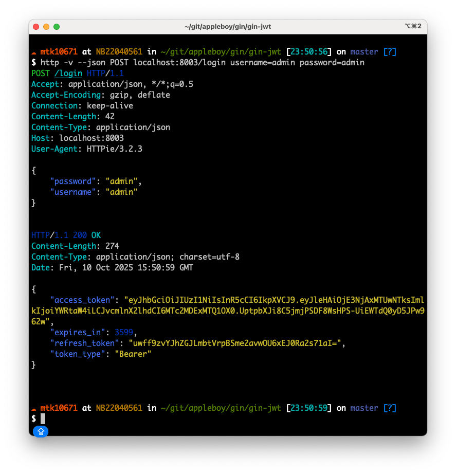
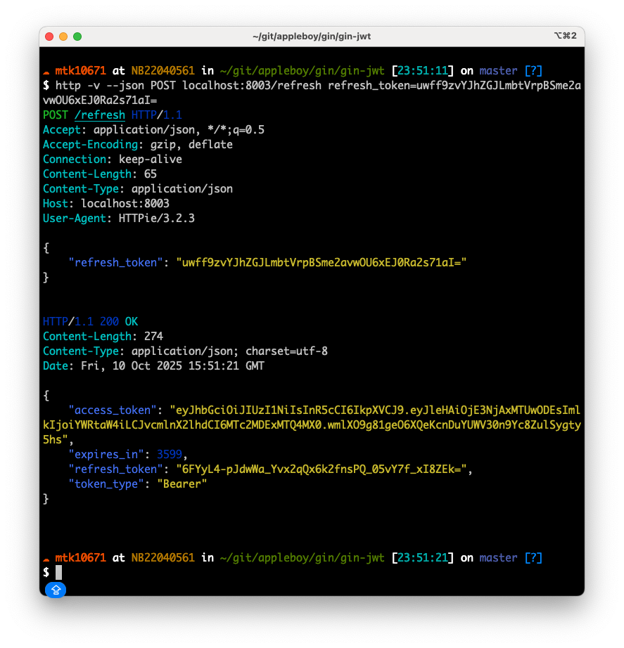

# Gin JWT 中间件

[English](README.md) | [繁體中文](README.zh-TW.md) | [简体中文](README.zh-CN.md)

[](https://github.com/appleboy/gin-jwt/actions/workflows/go.yml)
[](https://github.com/appleboy/gin-jwt/actions/workflows/trivy-scan.yml)
[](https://github.com/appleboy/gin-jwt/releases)
[](https://pkg.go.dev/github.com/appleboy/gin-jwt/v3)
[](https://codecov.io/gh/appleboy/gin-jwt)
[](https://sourcegraph.com/github.com/appleboy/gin-jwt?badge)

一个强大且灵活的 [Gin](https://github.com/gin-gonic/gin) Web 框架的 JWT 认证中间件，基于 [golang-jwt/jwt](https://github.com/golang-jwt/jwt) 实现。
轻松为你的 Gin 应用添加登录、Token 刷新与授权功能。

---

## 目录

- [Gin JWT 中间件](#gin-jwt-中间件)
  - [目录](#目录)
  - [功能特色](#功能特色)
  - [安全性注意事项](#安全性注意事项)
    - [🔒 关键安全要求](#-关键安全要求)
    - [🛡️ 生产环境安全检查清单](#️-生产环境安全检查清单)
    - [🔄 OAuth 2.0 安全标准](#-oauth-20-安全标准)
    - [💡 安全配置示例](#-安全配置示例)
  - [安装](#安装)
  - [快速开始示例](#快速开始示例)
  - [使用示例](#使用示例)
    - [🔑 基础认证](#-基础认证)
    - [🌐 OAuth SSO 集成](#-oauth-sso-集成)
    - [🔐 Token 生成器](#-token-生成器)
    - [🗄️ Redis 存储](#️-redis-存储)
    - [🛡️ 授权控制](#️-授权控制)
  - [配置](#配置)
  - [JWT 解析选项](#jwt-解析选项)
    - [时钟偏差容错（Leeway）](#时钟偏差容错leeway)
      - [何时使用 Leeway](#何时使用-leeway)
      - [配置示例](#配置示例)
      - [Leeway 工作原理](#leeway-工作原理)
    - [其他解析选项](#其他解析选项)
      - [JSON 数值处理](#json-数值处理)
      - [必需声明验证](#必需声明验证)
      - [组合多个选项](#组合多个选项)
  - [支持多个 JWT 提供者](#支持多个-jwt-提供者)
    - [使用场景](#使用场景)
    - [解决方案：动态密钥函数](#解决方案动态密钥函数)
      - [为什么这个方法有效](#为什么这个方法有效)
    - [实现策略](#实现策略)
      - [步骤 1：创建统一的中间件](#步骤-1创建统一的中间件)
      - [步骤 2：辅助函数](#步骤-2辅助函数)
      - [步骤 3：路由设置](#步骤-3路由设置)
    - [完整的 Azure AD 集成示例](#完整的-azure-ad-集成示例)
    - [替代方法：自定义包装中间件](#替代方法自定义包装中间件)
    - [关键考虑事项](#关键考虑事项)
    - [测试多提供者设置](#测试多提供者设置)
    - [常见问题与解决方案](#常见问题与解决方案)
    - [其他资源](#其他资源)
  - [Token 生成器（直接创建 Token）](#token-生成器直接创建-token)
    - [基本用法](#基本用法)
    - [Token 结构](#token-结构)
    - [刷新 Token 管理](#刷新-token-管理)
  - [Redis 存储配置](#redis-存储配置)
    - [Redis 功能特色](#redis-功能特色)
    - [Redis 使用方法](#redis-使用方法)
      - [使用函数选项模式（推荐）](#使用函数选项模式推荐)
      - [可用选项](#可用选项)
    - [配置选项](#配置选项)
      - [RedisConfig](#redisconfig)
    - [回退行为](#回退行为)
    - [Redis 示例](#redis-示例)
  - [Demo](#demo)
    - [登录](#登录)
    - [刷新 Token](#刷新-token)
    - [Hello World](#hello-world)
    - [授权示例](#授权示例)
  - [理解 Authorizer](#理解-authorizer)
    - [Authorizer 工作原理](#authorizer-工作原理)
    - [Authorizer 函数签名](#authorizer-函数签名)
    - [基本用法示例](#基本用法示例)
      - [示例 1：基于角色的授权](#示例-1基于角色的授权)
      - [示例 2：基于路径的授权](#示例-2基于路径的授权)
      - [示例 3：基于方法和路径的授权](#示例-3基于方法和路径的授权)
    - [为不同路由设置不同授权](#为不同路由设置不同授权)
      - [方法 1：多个中间件实例](#方法-1多个中间件实例)
      - [方法 2：带路径逻辑的单一 Authorizer](#方法-2带路径逻辑的单一-authorizer)
    - [高级授权模式](#高级授权模式)
      - [使用 Claims 进行细粒度控制](#使用-claims-进行细粒度控制)
    - [常见模式和最佳实践](#常见模式和最佳实践)
    - [授权完整示例](#授权完整示例)
    - [登出](#登出)
  - [Cookie Token](#cookie-token)
    - [刷新 Token Cookie 支持](#刷新-token-cookie-支持)
    - [登录流程（LoginHandler）](#登录流程loginhandler)
    - [需要 JWT Token 的端点（MiddlewareFunc）](#需要-jwt-token-的端点middlewarefunc)
    - [登出流程（LogoutHandler）](#登出流程logouthandler)
    - [刷新流程（RefreshHandler）](#刷新流程refreshhandler)
    - [登录失败、Token 错误或权限不足](#登录失败token-错误或权限不足)

---

## 功能特色

- 🔒 为 Gin 提供简单的 JWT 认证
- 🔁 内置登录、刷新、登出处理器
- 🛡️ 可自定义认证、授权与 Claims
- 🍪 支持 Cookie 与 Header Token
- 📝 易于集成，API 清晰
- 🔐 符合 RFC 6749 规范的刷新令牌（OAuth 2.0 标准）
- 🗄️ 可插拔的刷新令牌存储（内存、Redis 客户端缓存）
- 🏭 直接生成 Token，无需 HTTP 中间件
- 📦 结构化 Token 类型与元数据

---

## 安全性注意事项

### 🔒 关键安全要求

> **⚠️ JWT 密钥安全**
>
> - **最低要求：** 使用至少 **256 位（32 字节）** 长度的密钥
> - **禁止使用：** 简单密码、字典词汇或可预测的模式
> - **建议：** 生成加密安全的随机密钥或使用 `RS256` 算法
> - **存储：** 将密钥存储在环境变量中，绝不硬编码在源码中
> - **漏洞：** 弱密钥易受暴力破解攻击（[jwt-cracker](https://github.com/lmammino/jwt-cracker)）

### 🛡️ 生产环境安全检查清单

- ✅ **仅限 HTTPS：** 生产环境中务必使用 HTTPS
- ✅ **强密钥：** 最少 256 位随机生成的密钥
- ✅ **Token 过期：** 设置适当的过期时间（建议：访问 Token 15-60 分钟）
- ✅ **安全 Cookie：** 启用 `SecureCookie`、`CookieHTTPOnly` 和适当的 `SameSite` 设置
- ✅ **环境变量：** 将敏感配置存储在环境变量中
- ✅ **输入验证：** 彻底验证所有认证输入

### 🔄 OAuth 2.0 安全标准

此库遵循 **RFC 6749 OAuth 2.0** 安全标准：

- **分离令牌：** 使用不同的不透明刷新令牌（非 JWT）以增强安全性
- **服务器端存储：** 刷新令牌在服务器端存储和验证
- **令牌轮替：** 每次使用时自动轮替刷新令牌
- **增强安全性：** 防止 JWT 刷新令牌漏洞和重放攻击

### 💡 安全配置示例

```go
// ❌ 不良：弱密钥、不安全设置
authMiddleware := &jwt.GinJWTMiddleware{
    Key:         []byte("weak"),           // 太短！
    Timeout:     time.Hour * 24,          // 太长！
    SecureCookie: false,                  // 生产环境不安全！
}

// ✅ 良好：强安全配置
authMiddleware := &jwt.GinJWTMiddleware{
    Key:            []byte(os.Getenv("JWT_SECRET")), // 来自环境变量
    Timeout:        time.Minute * 15,                // 短期访问令牌
    MaxRefresh:     time.Hour * 24 * 7,             // 1 周刷新有效期
    SecureCookie:   true,                           // 仅限 HTTPS
    CookieHTTPOnly: true,                           // 防止 XSS
    CookieSameSite: http.SameSiteStrictMode,        // CSRF 保护
    SendCookie:     true,                           // 启用安全 Cookie
}
```

**更多安全指导，请参见我们的 [安全最佳实践指南](_docs/security.md)**

---

## 安装

需要 Go 1.26+

```bash
go get -u github.com/appleboy/gin-jwt/v3
```

```go
import "github.com/appleboy/gin-jwt/v3"
```

---

## 快速开始示例

请参考 [`_example/basic/server.go`](./_example/basic/server.go) 示例文件，并可使用 `ExtractClaims` 获取 JWT 内的用户数据。

```go
package main

import (
  "log"
  "net/http"
  "os"
  "time"

  jwt "github.com/appleboy/gin-jwt/v3"
  "github.com/gin-gonic/gin"
  "github.com/golang-jwt/jwt/v5"
)

type login struct {
  Username string `form:"username" json:"username" binding:"required"`
  Password string `form:"password" json:"password" binding:"required"`
}

var (
  identityKey = "id"
  port        string
)

// User demo
type User struct {
  UserName  string
  FirstName string
  LastName  string
}

func init() {
  port = os.Getenv("PORT")
  if port == "" {
    port = "8000"
  }
}

func main() {
  engine := gin.Default()
  // the jwt middleware
  authMiddleware, err := jwt.New(initParams())
  if err != nil {
    log.Fatal("JWT Error:" + err.Error())
  }

  // initialize middleware
  errInit := authMiddleware.MiddlewareInit()
  if errInit != nil {
    log.Fatal("authMiddleware.MiddlewareInit() Error:" + errInit.Error())
  }

  // register route
  registerRoute(engine, authMiddleware)

  // start http server
  if err = http.ListenAndServe(":"+port, engine); err != nil {
    log.Fatal(err)
  }
}

func registerRoute(r *gin.Engine, handle *jwt.GinJWTMiddleware) {
  // Public routes
  r.POST("/login", handle.LoginHandler)
  r.POST("/refresh", handle.RefreshHandler) // RFC 6749 compliant refresh endpoint

  r.NoRoute(handle.MiddlewareFunc(), handleNoRoute())

  // Protected routes
  auth := r.Group("/auth", handle.MiddlewareFunc())
  auth.GET("/hello", helloHandler)
  auth.POST("/logout", handle.LogoutHandler) // Logout with refresh token revocation
}

func initParams() *jwt.GinJWTMiddleware {
  return &jwt.GinJWTMiddleware{
    Realm:       "test zone",
    Key:         []byte("secret key"),
    Timeout:     time.Hour,
    MaxRefresh:  time.Hour,
    IdentityKey: identityKey,
    PayloadFunc: payloadFunc(),

    IdentityHandler: identityHandler(),
    Authenticator:   authenticator(),
    Authorizer:      authorizer(),
    Unauthorized:    unauthorized(),
    LogoutResponse:  logoutResponse(),
    TokenLookup:     "header: Authorization, query: token, cookie: jwt",
    // TokenLookup: "query:token",
    // TokenLookup: "cookie:token",
    TokenHeadName: "Bearer",
    TimeFunc:      time.Now,
  }
}

func payloadFunc() func(data any) jwt.MapClaims {
  return func(data any) jwt.MapClaims {
    if v, ok := data.(*User); ok {
      return jwt.MapClaims{
        identityKey: v.UserName,
      }
    }
    return jwt.MapClaims{}
  }
}

func identityHandler() func(c *gin.Context) any {
  return func(c *gin.Context) any {
    claims := jwt.ExtractClaims(c)
    return &User{
      UserName: claims[identityKey].(string),
    }
  }
}

func authenticator() func(c *gin.Context) (any, error) {
  return func(c *gin.Context) (any, error) {
    var loginVals login
    if err := c.ShouldBind(&loginVals); err != nil {
      return "", jwt.ErrMissingLoginValues
    }
    userID := loginVals.Username
    password := loginVals.Password

    if (userID == "admin" && password == "admin") || (userID == "test" && password == "test") {
      return &User{
        UserName:  userID,
        LastName:  "Bo-Yi",
        FirstName: "Wu",
      }, nil
    }
    return nil, jwt.ErrFailedAuthentication
  }
}

func authorizer() func(c *gin.Context, data any) bool {
  return func(c *gin.Context, data any) bool {
    if v, ok := data.(*User); ok && v.UserName == "admin" {
      return true
    }
    return false
  }
}

func unauthorized() func(c *gin.Context, code int, message string) {
  return func(c *gin.Context, code int, message string) {
    c.JSON(code, gin.H{
      "code":    code,
      "message": message,
    })
  }
}

func logoutResponse() func(c *gin.Context) {
  return func(c *gin.Context) {
    // This demonstrates that claims are now accessible during logout
    claims := jwt.ExtractClaims(c)
    user, exists := c.Get(identityKey)

    response := gin.H{
      "code":    http.StatusOK,
      "message": "Successfully logged out",
    }

    // Show that we can access user information during logout
    if len(claims) > 0 {
      response["logged_out_user"] = claims[identityKey]
    }
    if exists {
      response["user_info"] = user.(*User).UserName
    }

    c.JSON(http.StatusOK, response)
  }
}

func handleNoRoute() func(c *gin.Context) {
  return func(c *gin.Context) {
    c.JSON(404, gin.H{"code": "PAGE_NOT_FOUND", "message": "Page not found"})
  }
}

func helloHandler(c *gin.Context) {
  claims := jwt.ExtractClaims(c)
  user, _ := c.Get(identityKey)
  c.JSON(200, gin.H{
    "userID":   claims[identityKey],
    "userName": user.(*User).UserName,
    "text":     "Hello World.",
  })
}
```

---

## 使用示例

本项目提供多个完整的示例实现，展示不同的使用场景：

### 🔑 [基础认证](_example/basic/)

展示基本的 JWT 认证功能，包含登录、受保护路由和 token 验证。

### 🌐 [OAuth SSO 集成](_example/oauth_sso/)

**OAuth 2.0 单点登录**示例，支持多个身份提供者（Google、GitHub）：

- OAuth 2.0 授权码流程
- 使用 state token 的 CSRF 保护
- **双重认证支持**：httpOnly cookies + Authorization headers
- 为浏览器和移动应用程序提供安全的 token 传递
- 包含交互式 demo 页面

### 🔐 [Token 生成器](_example/token_generator/)

直接生成 JWT token，无需 HTTP middleware，适用于：

- 程序化认证
- 服务间通信
- 测试需要认证的端点
- 自定义认证流程

### 🗄️ [Redis 存储](_example/redis_simple/)

展示 Redis 集成用于 refresh token 存储，包含：

- 客户端缓存以提升性能
- 自动降级至内存存储
- 生产环境就绪的配置示例

### 🛡️ [授权控制](_example/authorization/)

高级授权模式，包含：

- 基于角色的访问控制
- 基于路径的授权
- 多个 middleware 实例
- 精细的权限控制

---

## 配置

`GinJWTMiddleware` 结构体提供以下配置选项：

| 选项                   | 类型                                             | 必填 | 默认值                   | 描述                                                                    |
| ---------------------- | ------------------------------------------------ | ---- | ------------------------ | ----------------------------------------------------------------------- |
| Realm                  | `string`                                         | 否   | `"gin jwt"`              | 显示给用户的 Realm 名称。                                               |
| SigningAlgorithm       | `string`                                         | 否   | `"HS256"`                | 签名算法 (HS256, HS384, HS512, RS256, RS384, RS512)。                   |
| Key                    | `[]byte`                                         | 是   | -                        | 用于签名的密钥。                                                        |
| Timeout                | `time.Duration`                                  | 否   | `time.Hour`              | JWT Token 的有效期。                                                    |
| MaxRefresh             | `time.Duration`                                  | 否   | `0`                      | 刷新 Token 的有效期。                                                   |
| Authenticator          | `func(c *gin.Context) (any, error)`              | 是   | -                        | 验证用户的回调函数。返回用户数据。                                      |
| Authorizer             | `func(c *gin.Context, data any) bool`            | 否   | `true`                   | 授权已验证用户的回调函数。                                              |
| PayloadFunc            | `func(data any) jwt.MapClaims`                   | 否   | -                        | 向 Token 添加额外 Payload 数据的回调函数。                              |
| Unauthorized           | `func(c *gin.Context, code int, message string)` | 否   | -                        | 处理未授权请求的回调函数。                                              |
| LoginResponse          | `func(c *gin.Context, token *core.Token)`        | 否   | -                        | 处理成功登录响应的回调函数。                                            |
| LogoutResponse         | `func(c *gin.Context)`                           | 否   | -                        | 处理成功登出响应的回调函数。                                            |
| RefreshResponse        | `func(c *gin.Context, token *core.Token)`        | 否   | -                        | 处理成功刷新响应的回调函数。                                            |
| IdentityHandler        | `func(*gin.Context) any`                         | 否   | -                        | 从 Claims 检索身份的回调函数。                                          |
| IdentityKey            | `string`                                         | 否   | `"identity"`             | 用于在 Claims 中存储身份的键。                                          |
| TokenLookup            | `string`                                         | 否   | `"header:Authorization"` | 提取 Token 的来源（header, query, cookie）。                            |
| TokenHeadName          | `string`                                         | 否   | `"Bearer"`               | Header 名称前缀。                                                       |
| TimeFunc               | `func() time.Time`                               | 否   | `time.Now`               | 提供当前时间的函数。                                                    |
| PrivKeyFile            | `string`                                         | 否   | -                        | 私钥文件路径（用于 RS 算法）。                                          |
| PubKeyFile             | `string`                                         | 否   | -                        | 公钥文件路径（用于 RS 算法）。                                          |
| SendCookie             | `bool`                                           | 否   | `false`                  | 是否将 Token 作为 Cookie 发送。                                         |
| CookieMaxAge           | `time.Duration`                                  | 否   | `Timeout`                | Cookie 的有效期。                                                       |
| SecureCookie           | `bool`                                           | 否   | `false`                  | 是否对访问令牌使用安全 Cookie（仅限 HTTPS）。刷新令牌 Cookie 始终安全。 |
| CookieHTTPOnly         | `bool`                                           | 否   | `false`                  | 是否使用 HTTPOnly Cookie。                                              |
| CookieDomain           | `string`                                         | 否   | -                        | Cookie 的域名。                                                         |
| CookieName             | `string`                                         | 否   | `"jwt"`                  | Cookie 的名称。                                                         |
| RefreshTokenCookieName | `string`                                         | 否   | `"refresh_token"`        | 刷新 Token Cookie 的名称。                                              |
| CookieSameSite         | `http.SameSite`                                  | 否   | -                        | Cookie 的 SameSite 属性。                                               |
| SendAuthorization      | `bool`                                           | 否   | `false`                  | 是否为每个请求返回授权 Header。                                         |
| DisabledAbort          | `bool`                                           | 否   | `false`                  | 禁用 context 的 abort()。                                               |
| ParseOptions           | `[]jwt.ParserOption`                             | 否   | -                        | 解析 JWT 的选项。                                                       |

---

## JWT 解析选项

`ParseOptions` 字段允许你使用 [golang-jwt/jwt](https://github.com/golang-jwt/jwt) 库提供的选项自定义 JWT 解析行为。这对于处理时钟偏差、自定义验证规则和数值类型声明特别有用。

### 时钟偏差容错（Leeway）

在多台服务器运行的分布式系统中，时钟同步问题可能导致有效的 Token 被拒绝。`jwt.WithLeeway()` 选项为验证基于时间的声明（`exp`、`nbf`、`iat`）添加时间缓冲，防止因服务之间的微小时钟差异而导致身份验证失败。

#### 何时使用 Leeway

- 🌐 **微服务架构**：不同机器上的服务时钟略有不同步
- ☁️ **云部署**：跨不同可用区或地区的分布式系统
- 🔄 **负载均衡环境**：多个后端服务器存在小的时间漂移
- 🧪 **测试环境**：开发/测试系统的时间同步要求不严格

#### 配置示例

```go
authMiddleware, err := jwt.New(&jwt.GinJWTMiddleware{
    Realm:      "your realm",
    Key:        []byte("your-secret-key"),
    Timeout:    time.Hour,
    MaxRefresh: time.Hour * 24,

    // 添加 60 秒的时钟偏差容错
    ParseOptions: []jwt.ParserOption{
        jwt.WithLeeway(60 * time.Second),
    },

    Authenticator: func(c *gin.Context) (interface{}, error) {
        // 你的认证逻辑
    },
    // ... 其他配置
})
```

#### Leeway 工作原理

使用 60 秒的 leeway 配置：

- **过期的 Token**：30 秒前过期的 Token 仍会被接受
- **未生效的 Token**：`nbf`（不早于）时间在未来 30 秒内的 Token 会被接受
- **签发时间验证**：`iat`（签发时间）略在未来的 Token 会被接受

**安全提示**：使用合理的 leeway 值（30-120 秒）。过大的 leeway 会降低 Token 安全性，因为它会延长超出预期过期时间的有效期。

### 其他解析选项

#### JSON 数值处理

默认情况下，JWT 数值声明被解析为 `float64`。使用 `jwt.WithJSONNumber()` 保留精确的数值：

```go
ParseOptions: []jwt.ParserOption{
    jwt.WithJSONNumber(),
}
```

这在需要精确整数值或想避免浮点精度问题时很有用。

#### 必需声明验证

强制要求 Token 中必须包含某些声明：

```go
ParseOptions: []jwt.ParserOption{
    jwt.WithExpirationRequired(),  // 要求 'exp' 声明
    jwt.WithIssuedAt(),            // 如果存在则验证 'iat' 声明
}
```

#### 组合多个选项

你可以组合多个解析器选项：

```go
ParseOptions: []jwt.ParserOption{
    jwt.WithLeeway(60 * time.Second),  // 60 秒时钟偏差容错
    jwt.WithJSONNumber(),              // 保留数值精度
    jwt.WithExpirationRequired(),      // 要求过期声明
}
```

---

## 支持多个 JWT 提供者

在某些场景中，你可能需要接受来自多个来源的 JWT Token，例如你自己的认证系统和外部身份提供者（如 Azure AD、Auth0 或其他 OAuth 2.0 提供者）。本节说明如何使用 `KeyFunc` 回调函数实现多提供者 Token 验证。

### 使用场景

- 🔐 **混合认证**：同时支持内部和外部认证
- 🌐 **第三方集成**：接受来自 Azure AD、Google、Auth0 等的 Token
- 🔄 **迁移场景**：从一个认证系统逐步迁移到另一个
- 🏢 **企业 SSO**：在一般认证之外支持企业单点登录

### 解决方案：动态密钥函数

推荐的方法是使用**单一中间件配合动态 `KeyFunc`**，根据 Token 属性（例如 issuer claim）来决定适当的验证方法。

#### 为什么这个方法有效

`KeyFunc` 回调函数（auth_jwt.go:41）正是为此目的而设计。它允许你：

- 在验证前检查 Token
- 动态选择正确的签名密钥/方法
- 避免串联多个中间件时的中止问题

### 实现策略

#### 步骤 1：创建统一的中间件

```go
package main

import (
    "errors"
    "fmt"
    "strings"
    "time"

    jwt "github.com/appleboy/gin-jwt/v3"
    "github.com/gin-gonic/gin"
    "github.com/golang-jwt/jwt/v5"
)

func createMultiProviderAuthMiddleware() (*jwt.GinJWTMiddleware, error) {
    // 你自己的 JWT 密钥
    ownSecret := []byte("your-secret-key")

    // Azure AD 公钥（从 JWKS 端点获取）
    azurePublicKeys := getAzurePublicKeys()

    return jwt.New(&jwt.GinJWTMiddleware{
        Realm:       "multi-provider-api",
        Key:         ownSecret, // 默认密钥（必要但可能不会使用）
        IdentityKey: "sub",
        Timeout:     time.Hour,

        // 动态密钥函数 - 多提供者支持的核心
        KeyFunc: func(token *jwt.Token) (interface{}, error) {
            // 提取 claims 以判断 Token 来源
            claims, ok := token.Claims.(jwt.MapClaims)
            if !ok {
                return nil, errors.New("invalid claims type")
            }

            // 检查 issuer claim 以识别 Token 来源
            issuer, _ := claims["iss"].(string)

            // 路由 1：Azure AD Token
            if isAzureADIssuer(issuer) {
                // 验证算法
                if token.Method.Alg() != "RS256" {
                    return nil, fmt.Errorf("unexpected signing method: %v", token.Header["alg"])
                }

                // 从 Token header 获取密钥 ID
                keyID, ok := token.Header["kid"].(string)
                if !ok {
                    return nil, errors.New("missing key ID in Azure AD token header")
                }

                // 查找公钥
                if key, found := azurePublicKeys[keyID]; found {
                    return key, nil
                }
                return nil, fmt.Errorf("unknown Azure AD key ID: %s", keyID)
            }

            // 路由 2：你自己的 Token
            // 验证签名方法符合你的配置
            if token.Method.Alg() != "HS256" {
                return nil, fmt.Errorf("unexpected signing method: %v", token.Header["alg"])
            }

            return ownSecret, nil
        },

        // 处理不同提供者的不同身份格式
        IdentityHandler: func(c *gin.Context) interface{} {
            claims := jwt.ExtractClaims(c)

            // 尝试标准 "sub" claim（大多数 OAuth 提供者使用）
            if sub, ok := claims["sub"].(string); ok {
                return sub
            }

            // 回退到自定义 "identity" claim
            if identity, ok := claims["identity"].(string); ok {
                return identity
            }

            return nil
        },

        // 可选：提供者特定的授权
        Authorizer: func(c *gin.Context, data interface{}) bool {
            claims := jwt.ExtractClaims(c)
            issuer, _ := claims["iss"].(string)

            // Azure AD 特定授权
            if isAzureADIssuer(issuer) {
                return authorizeAzureADUser(claims, c)
            }

            // 你自己的 Token 授权
            return authorizeOwnUser(claims, c)
        },

        // 可选：针对不同提供者的自定义错误消息
        HTTPStatusMessageFunc: func(c *gin.Context, e error) string {
            if strings.Contains(e.Error(), "Azure AD") {
                return "Azure AD token validation failed: " + e.Error()
            }
            return e.Error()
        },
    })
}
```

#### 步骤 2：辅助函数

```go
// 检查 issuer 是否来自 Azure AD
func isAzureADIssuer(issuer string) bool {
    // Azure AD issuer 看起来像：
    // https://login.microsoftonline.com/{tenant}/v2.0
    // https://sts.windows.net/{tenant}/
    return strings.Contains(issuer, "login.microsoftonline.com") ||
           strings.Contains(issuer, "sts.windows.net")
}

// 从 JWKS 端点获取并缓存 Azure AD 公钥
func getAzurePublicKeys() map[string]interface{} {
    // 实现：从 Azure AD JWKS 端点获取
    // https://login.microsoftonline.com/common/discovery/v2.0/keys
    // 或特定租户：https://login.microsoftonline.com/{tenant}/discovery/v2.0/keys

    // 使用库如 github.com/lestrrat-go/jwx/v2/jwk 来解析 JWKS
    // 实现缓存以避免每个请求都获取

    keys := make(map[string]interface{})

    // 示例结构（你需要实现实际的获取）：
    // jwkSet, err := jwk.Fetch(context.Background(),
    //     "https://login.microsoftonline.com/common/discovery/v2.0/keys")
    // if err != nil {
    //     log.Printf("Failed to fetch Azure AD keys: %v", err)
    //     return keys
    // }
    //
    // for it := jwkSet.Iterate(context.Background()); it.Next(context.Background()); {
    //     pair := it.Pair()
    //     key := pair.Value.(jwk.Key)
    //
    //     var rawKey interface{}
    //     if err := key.Raw(&rawKey); err == nil {
    //         keys[key.KeyID()] = rawKey
    //     }
    // }

    return keys
}

// Azure AD 特定授权
func authorizeAzureADUser(claims jwt.MapClaims, c *gin.Context) bool {
    // 检查 Azure AD 特定 claims

    // 示例：检查 roles claim
    if roles, ok := claims["roles"].([]interface{}); ok {
        for _, role := range roles {
            if role.(string) == "Admin" || role.(string) == "User" {
                return true
            }
        }
    }

    // 示例：检查 groups claim
    if groups, ok := claims["groups"].([]interface{}); ok {
        allowedGroups := []string{"group-id-1", "group-id-2"}
        for _, group := range groups {
            for _, allowed := range allowedGroups {
                if group.(string) == allowed {
                    return true
                }
            }
        }
    }

    // 示例：检查 app roles
    if appRoles, ok := claims["app_role"].(string); ok {
        if appRoles == "User.Read" || appRoles == "Admin.All" {
            return true
        }
    }

    return false
}

// 你自己的 Token 授权
func authorizeOwnUser(claims jwt.MapClaims, c *gin.Context) bool {
    // 你的自定义授权逻辑
    if role, ok := claims["role"].(string); ok {
        return role == "admin" || role == "user"
    }
    return true
}
```

#### 步骤 3：路由设置

```go
func main() {
    r := gin.Default()

    // 初始化多提供者中间件
    authMiddleware, err := createMultiProviderAuthMiddleware()
    if err != nil {
        log.Fatal("JWT Error: " + err.Error())
    }

    if err := authMiddleware.MiddlewareInit(); err != nil {
        log.Fatal("Middleware Init Error: " + err.Error())
    }

    // 公开路由
    r.POST("/login", authMiddleware.LoginHandler) // 用于你自己的认证
    r.POST("/refresh", authMiddleware.RefreshHandler)

    // 受保护路由 - 接受来自任何已配置提供者的 Token
    auth := r.Group("/api")
    auth.Use(authMiddleware.MiddlewareFunc())
    {
        auth.GET("/profile", func(c *gin.Context) {
            claims := jwt.ExtractClaims(c)
            issuer := claims["iss"].(string)

            c.JSON(200, gin.H{
                "message": "Success",
                "user_id": claims["sub"],
                "issuer":  issuer,
                "source":  determineTokenSource(issuer),
            })
        })
    }

    r.Run(":8080")
}

func determineTokenSource(issuer string) string {
    if isAzureADIssuer(issuer) {
        return "Azure AD"
    }
    return "Internal"
}
```

### 完整的 Azure AD 集成示例

对于生产环境就绪的 Azure AD 集成，你需要：

**动态获取 JWKS 密钥**：

```go
import (
    "context"
    "crypto/rsa"
    "sync"
    "time"

    "github.com/lestrrat-go/jwx/v2/jwk"
)

type AzureADKeyProvider struct {
    jwksURL    string
    keys       map[string]*rsa.PublicKey
    mutex      sync.RWMutex
    lastUpdate time.Time
}

func NewAzureADKeyProvider(tenantID string) *AzureADKeyProvider {
    provider := &AzureADKeyProvider{
        jwksURL: fmt.Sprintf(
            "https://login.microsoftonline.com/%s/discovery/v2.0/keys",
            tenantID,
        ),
        keys: make(map[string]*rsa.PublicKey),
    }

    // 初始获取
    provider.RefreshKeys()

    // 每小时刷新密钥
    go func() {
        ticker := time.NewTicker(1 * time.Hour)
        defer ticker.Stop()
        for range ticker.C {
            provider.RefreshKeys()
        }
    }()

    return provider
}

func (p *AzureADKeyProvider) RefreshKeys() error {
    ctx, cancel := context.WithTimeout(context.Background(), 10*time.Second)
    defer cancel()

    set, err := jwk.Fetch(ctx, p.jwksURL)
    if err != nil {
        return fmt.Errorf("failed to fetch JWKS: %w", err)
    }

    newKeys := make(map[string]*rsa.PublicKey)

    for it := set.Keys(ctx); it.Next(ctx); {
        key := it.Pair().Value.(jwk.Key)

        var rawKey interface{}
        if err := key.Raw(&rawKey); err != nil {
            continue
        }

        if rsaKey, ok := rawKey.(*rsa.PublicKey); ok {
            newKeys[key.KeyID()] = rsaKey
        }
    }

    p.mutex.Lock()
    p.keys = newKeys
    p.lastUpdate = time.Now()
    p.mutex.Unlock()

    return nil
}

func (p *AzureADKeyProvider) GetKey(keyID string) (*rsa.PublicKey, bool) {
    p.mutex.RLock()
    defer p.mutex.RUnlock()

    key, found := p.keys[keyID]
    return key, found
}
```

**验证 Azure AD 特定 Claims**：

```go
func validateAzureADClaims(claims jwt.MapClaims) error {
    // 验证 issuer
    iss, ok := claims["iss"].(string)
    if !ok || !isAzureADIssuer(iss) {
        return errors.New("invalid Azure AD issuer")
    }

    // 验证 audience（你的应用程序 ID）
    aud, ok := claims["aud"].(string)
    if !ok || aud != "your-app-client-id" {
        return errors.New("invalid audience")
    }

    // 验证租户（可选，适用于单租户应用程序）
    tid, ok := claims["tid"].(string)
    if !ok || tid != "your-tenant-id" {
        return errors.New("invalid tenant")
    }

    return nil
}
```

### 替代方法：自定义包装中间件

如果你需要更多控制或想要完全分离提供者：

```go
func MultiAuthMiddleware(
    ownAuth *jwt.GinJWTMiddleware,
    externalAuth *jwt.GinJWTMiddleware,
) gin.HandlerFunc {
    return func(c *gin.Context) {
        // 先尝试自己的认证
        ownAuth.DisabledAbort = true
        ownAuth.MiddlewareFunc()(c)

        // 检查认证是否成功
        if _, exists := c.Get("JWT_PAYLOAD"); exists {
            c.Next()
            return
        }

        // 清除错误并尝试外部提供者
        c.Errors = c.Errors[:0]

        externalAuth.DisabledAbort = true
        externalAuth.MiddlewareFunc()(c)

        if _, exists := c.Get("JWT_PAYLOAD"); exists {
            c.Next()
            return
        }

        // 两者都失败
        c.JSON(401, gin.H{
            "code":    401,
            "message": "Invalid or missing authentication token",
        })
        c.Abort()
    }
}
```

### 关键考虑事项

1. **Token Issuer 验证**：始终验证 `iss` claim 以确保 Token 来自可信来源
2. **Audience 验证**：验证 `aud` claim 符合你的应用程序客户端 ID
3. **算法验证**：确保签名算法符合预期（你的 Token 用 HS256，Azure AD 用 RS256）
4. **密钥缓存**：缓存来自 JWKS 端点的公钥以降低延迟
5. **密钥轮换**：实现自动密钥刷新以处理提供者的密钥轮换
6. **错误处理**：提供清楚的错误消息指出哪个提供者的验证失败
7. **安全性**：绝不跳过签名验证或禁用安全检查

### 测试多提供者设置

```bash
# 使用你自己的 Token 测试
curl -H "Authorization: Bearer YOUR_INTERNAL_TOKEN" \
     http://localhost:8080/api/profile

# 使用 Azure AD Token 测试
curl -H "Authorization: Bearer AZURE_AD_TOKEN" \
     http://localhost:8080/api/profile
```

### 常见问题与解决方案

**问题**："串联中间件会导致第一个失败时中止请求"

- **解决方案**：使用 `KeyFunc` 方法配合单一中间件实例

**问题**："Azure AD 公钥会定期变更"

- **解决方案**：实现自动 JWKS 刷新（如 AzureADKeyProvider 示例所示）

**问题**："不同提供者的 Token 格式不同"

- **解决方案**：在 `IdentityHandler` 中标准化 claims 并处理提供者特定的格式

**问题**："不同提供者的授权逻辑不同"

- **解决方案**：在 `Authorizer` 中检查 issuer 并路由到提供者特定的逻辑

### 其他资源

- [Azure AD Token 验证](https://docs.microsoft.com/en-us/azure/active-directory/develop/access-tokens)
- [JWKS (JSON Web Key Sets)](https://auth0.com/docs/secure/tokens/json-web-tokens/json-web-key-sets)
- [RFC 7517 - JSON Web Key (JWK)](https://tools.ietf.org/html/rfc7517)
- [lestrrat-go/jwx 库](https://github.com/lestrrat-go/jwx) 用于 JWKS 处理

---

## Token 生成器（直接创建 Token）

`TokenGenerator` 功能让你可以直接创建 JWT Token 而无需 HTTP 中间件，非常适合程序化认证、测试和自定义流程。

### 基本用法

```go
package main

import (
    "context"
    "fmt"
    "log"
    "time"

    jwt "github.com/appleboy/gin-jwt/v3"
    gojwt "github.com/golang-jwt/jwt/v5"
)

func main() {
    // 初始化中间件
    authMiddleware, err := jwt.New(&jwt.GinJWTMiddleware{
        Realm:      "example zone",
        Key:        []byte("secret key"),
        Timeout:    time.Hour,
        MaxRefresh: time.Hour * 24,
        PayloadFunc: func(data any) gojwt.MapClaims {
            return gojwt.MapClaims{
                "user_id": data,
            }
        },
    })
    if err != nil {
        log.Fatal("JWT Error:" + err.Error())
    }

    // 创建 Token 操作的 context
    ctx := context.Background()

    // 生成完整的 Token 组（访问 + 刷新 Token）
    userData := "user123"
    tokenPair, err := authMiddleware.TokenGenerator(ctx, userData)
    if err != nil {
        log.Fatal("Failed to generate token pair:", err)
    }

    fmt.Printf("Access Token: %s\n", tokenPair.AccessToken)
    fmt.Printf("Refresh Token: %s\n", tokenPair.RefreshToken)
    fmt.Printf("Expires In: %d seconds\n", tokenPair.ExpiresIn())
}
```

### Token 结构

`TokenGenerator` 方法返回结构化的 `core.Token`：

```go
type Token struct {
    AccessToken  string `json:"access_token"`   // JWT 访问 Token
    TokenType    string `json:"token_type"`     // 总是 "Bearer"
    RefreshToken string `json:"refresh_token"`  // 不透明刷新 Token
    ExpiresAt    int64  `json:"expires_at"`     // Unix 时间戳
    CreatedAt    int64  `json:"created_at"`     // Unix 时间戳
}

// 辅助方法
func (t *Token) ExpiresIn() int64 // 返回到期前的秒数
```

### 刷新 Token 管理

使用 `TokenGeneratorWithRevocation` 来刷新 Token 并自动撤销旧 Token：

```go
// 刷新并自动撤销旧 Token
newTokenPair, err := authMiddleware.TokenGeneratorWithRevocation(userData, oldRefreshToken)
if err != nil {
    log.Fatal("Failed to refresh token:", err)
}

// 旧刷新 Token 现在已失效
fmt.Printf("New Access Token: %s\n", newTokenPair.AccessToken)
fmt.Printf("New Refresh Token: %s\n", newTokenPair.RefreshToken)
```

**使用场景：**

- 🔧 **程序化认证**：服务间通信
- 🧪 **测试**：为测试认证端点生成 Token
- 📝 **注册流程**：用户注册后立即发放 Token
- ⚙️ **后台作业**：为自动化流程创建 Token
- 🎛️ **自定义认证流程**：构建自定义认证逻辑

详见[完整示例](_example/token_generator/)。

---

## Redis 存储配置

此库支持 Redis 作为刷新令牌存储后端，并内置客户端缓存以提升性能。相比默认的内存存储，Redis 存储提供更好的可扩展性和持久性。

### Redis 功能特色

- 🔄 **客户端缓存**：内置 Redis 客户端缓存以提升性能
- 🚀 **自动回退**：Redis 连接失败时自动回退到内存存储
- ⚙️ **简易配置**：简单的方法配置 Redis 存储
- 🔧 **方法链**：流畅的 API，便于配置
- 📦 **工厂模式**：同时支持 Redis 和内存存储

### Redis 使用方法

#### 使用函数选项模式（推荐）

Redis 配置现在使用函数选项模式，提供更清洁且灵活的配置：

```go
// 方法 1：使用默认配置启用 Redis
middleware := &jwt.GinJWTMiddleware{
    // ... 其他配置
}.EnableRedisStore()

// 方法 2：使用自定义地址启用 Redis
middleware := &jwt.GinJWTMiddleware{
    // ... 其他配置
}.EnableRedisStore(
    jwt.WithRedisAddr("redis.example.com:6379"),
)

// 方法 3：使用认证启用 Redis
middleware := &jwt.GinJWTMiddleware{
    // ... 其他配置
}.EnableRedisStore(
    jwt.WithRedisAddr("redis.example.com:6379"),
    jwt.WithRedisAuth("password", 0),
)

// 方法 4：使用所有选项的完整配置
middleware := &jwt.GinJWTMiddleware{
    // ... 其他配置
}.EnableRedisStore(
    jwt.WithRedisAddr("redis.example.com:6379"),
    jwt.WithRedisAuth("password", 1),
    jwt.WithRedisCache(128*1024*1024, time.Minute),     // 128MB 缓存，1分钟 TTL
    jwt.WithRedisPool(20, time.Hour, 2*time.Hour),      // 连接池配置
    jwt.WithRedisKeyPrefix("myapp:jwt:"),               // 键前缀
)

// 方法 5：使用 TLS 启用 Redis（用于安全连接）
tlsConfig := &tls.Config{
    MinVersion: tls.VersionTLS12,
}
middleware := &jwt.GinJWTMiddleware{
    // ... 其他配置
}.EnableRedisStore(
    jwt.WithRedisAddr("redis.example.com:6380"),        // TLS 端口
    jwt.WithRedisAuth("password", 0),
    jwt.WithRedisTLS(tlsConfig),                        // 启用 TLS
)
```

#### 可用选项

- `WithRedisAddr(addr string)` - 设置 Redis 服务器地址
- `WithRedisAuth(password string, db int)` - 设置认证和数据库
- `WithRedisTLS(tlsConfig *tls.Config)` - 设置 TLS 配置以进行安全连接
- `WithRedisCache(size int, ttl time.Duration)` - 配置客户端缓存
- `WithRedisPool(poolSize int, maxIdleTime, maxLifetime time.Duration)` - 配置连接池
- `WithRedisKeyPrefix(prefix string)` - 设置 Redis 键的前缀

### 配置选项

#### RedisConfig

- **Addr**：Redis 服务器地址（默认：`"localhost:6379"`）
- **Password**：Redis 密码（默认：`""`）
- **DB**：Redis 数据库编号（默认：`0`）
- **TLSConfig**：用于安全连接的 TLS 配置（默认：`nil`）
- **CacheSize**：客户端缓存大小（字节）（默认：`128MB`）
- **CacheTTL**：客户端缓存 TTL（默认：`1 分钟`）
- **KeyPrefix**：所有 Redis 键的前缀（默认：`"gin-jwt:"`）

### 回退行为

如果在初始化期间 Redis 连接失败：

- 中间件会记录错误消息
- 自动回退到内存存储
- 应用程序继续正常运行

这确保了高可用性，防止因 Redis 连接问题导致的应用程序故障。

### Redis 示例

参见[Redis 示例](_example/redis_simple/)了解完整实现。

```go
package main

import (
    "log"
    "net/http"
    "time"

    jwt "github.com/appleboy/gin-jwt/v3"
    "github.com/gin-gonic/gin"
)

func main() {
    r := gin.Default()

    authMiddleware, err := jwt.New(&jwt.GinJWTMiddleware{
        Realm:       "example zone",
        Key:         []byte("secret key"),
        Timeout:     time.Hour,
        MaxRefresh:  time.Hour * 24,
        IdentityKey: "id",

        PayloadFunc: func(data any) jwt.MapClaims {
            if v, ok := data.(map[string]any); ok {
                return jwt.MapClaims{
                    "id": v["username"],
                }
            }
            return jwt.MapClaims{}
        },

        Authenticator: func(c *gin.Context) (any, error) {
            var loginVals struct {
                Username string `json:"username"`
                Password string `json:"password"`
            }

            if err := c.ShouldBind(&loginVals); err != nil {
                return "", jwt.ErrMissingLoginValues
            }

            if loginVals.Username == "admin" && loginVals.Password == "admin" {
                return map[string]any{
                    "username": loginVals.Username,
                }, nil
            }

            return nil, jwt.ErrFailedAuthentication
        },
    }).EnableRedisStore(                                            // 使用选项启用 Redis
        jwt.WithRedisAddr("localhost:6379"),                       // Redis 服务器地址
        jwt.WithRedisCache(64*1024*1024, 30*time.Second),         // 64MB 缓存，30秒 TTL
    )

    if err != nil {
        log.Fatal("JWT Error:" + err.Error())
    }

    errInit := authMiddleware.MiddlewareInit()
    if errInit != nil {
        log.Fatal("authMiddleware.MiddlewareInit() Error:" + errInit.Error())
    }

    r.POST("/login", authMiddleware.LoginHandler)

    auth := r.Group("/auth")
    auth.Use(authMiddleware.MiddlewareFunc())
    {
        auth.GET("/hello", func(c *gin.Context) {
            c.JSON(200, gin.H{
                "message": "Hello World.",
            })
        })
        auth.GET("/refresh_token", authMiddleware.RefreshHandler)
    }

    if err := http.ListenAndServe(":8000", r); err != nil {
        log.Fatal(err)
    }
}
```

---

## Demo

启动示例服务器：

```sh
go run _example/basic/server.go
```

建议安装 [httpie](https://github.com/jkbrzt/httpie) 进行 API 测试。

### 登录

```sh
http -v --json POST localhost:8000/login username=admin password=admin
```



### 刷新 Token

使用符合 RFC 6749 规范的刷新令牌（默认行为）：

```sh
# 首先登录获取刷新令牌
http -v --json POST localhost:8000/login username=admin password=admin

# 方法 1：启用 Cookie 时（自动 - 推荐用于浏览器）
# 刷新令牌 Cookie 会自动发送，无需手动包含
http -v POST localhost:8000/refresh --session=./session.json

# 方法 2：在 JSON 正文中发送刷新令牌
http -v --json POST localhost:8000/refresh refresh_token=your_refresh_token_here

# 方法 3：通过表单数据使用响应中的刷新令牌
http -v --form POST localhost:8000/refresh refresh_token=your_refresh_token_here
```

**安全提示**：当 `SendCookie` 启用时，刷新令牌会自动存储在 httpOnly Cookie 中。基于浏览器的应用程序只需调用刷新端点，无需手动包含令牌，Cookie 机制会自动处理。

**重要**：不支持使用查询参数传递刷新令牌，因为它们会在服务器日志、代理日志、浏览器历史记录和 Referer 标头中暴露令牌。请使用 Cookie（推荐）、JSON 正文或表单数据。



### Hello World

以 `admin`/`admin` 登录后调用：

```sh
http -f GET localhost:8000/auth/hello "Authorization:Bearer xxxxxxxxx"  "Content-Type: application/json"
```

**响应：**

```json
{
  "text": "Hello World.",
  "userID": "admin"
}
```

### 授权示例

以 `test`/`test` 登录后调用：

```sh
http -f GET localhost:8000/auth/hello "Authorization:Bearer xxxxxxxxx"  "Content-Type: application/json"
```

**响应：**

```json
{
  "code": 403,
  "message": "You don't have permission to access."
}
```

---

## 理解 Authorizer

`Authorizer` 函数是在应用程序中实现基于角色的访问控制的关键组件。它决定已认证用户是否有权限访问特定的受保护路由。

### Authorizer 工作原理

`Authorizer` 在使用 `MiddlewareFunc()` 的任何路由的 JWT 中间件处理过程中**自动调用**。执行流程如下：

1. **Token 验证**：JWT 中间件验证 token
2. **身份提取**：`IdentityHandler` 从 token claims 中提取用户身份
3. **授权检查**：`Authorizer` 决定用户是否可以访问资源
4. **路由访问**：如果授权通过，请求继续；否则调用 `Unauthorized`

### Authorizer 函数签名

```go
func(c *gin.Context, data any) bool
```

- `c *gin.Context`：包含请求信息的 Gin 上下文
- `data any`：由 `IdentityHandler` 返回的用户身份数据
- 返回 `bool`：`true` 表示授权访问，`false` 表示拒绝访问

### 基本用法示例

#### 示例 1：基于角色的授权

```go
func authorizeHandler() func(c *gin.Context, data any) bool {
    return func(c *gin.Context, data any) bool {
        if v, ok := data.(*User); ok && v.UserName == "admin" {
            return true  // 只有 admin 用户可以访问
        }
        return false
    }
}
```

#### 示例 2：基于路径的授权

```go
func authorizeHandler() func(c *gin.Context, data any) bool {
    return func(c *gin.Context, data any) bool {
        user, ok := data.(*User)
        if !ok {
            return false
        }

        path := c.Request.URL.Path

        // Admin 可以访问所有路由
        if user.Role == "admin" {
            return true
        }

        // 普通用户只能访问 /auth/profile 和 /auth/hello
        allowedPaths := []string{"/auth/profile", "/auth/hello"}
        for _, allowedPath := range allowedPaths {
            if path == allowedPath {
                return true
            }
        }

        return false
    }
}
```

#### 示例 3：基于方法和路径的授权

```go
func authorizeHandler() func(c *gin.Context, data any) bool {
    return func(c *gin.Context, data any) bool {
        user, ok := data.(*User)
        if !ok {
            return false
        }

        path := c.Request.URL.Path
        method := c.Request.Method

        // 管理员拥有完全访问权限
        if user.Role == "admin" {
            return true
        }

        // 用户只能 GET 自己的资料
        if path == "/auth/profile" && method == "GET" {
            return true
        }

        // 用户不能修改或删除资源
        if method == "POST" || method == "PUT" || method == "DELETE" {
            return false
        }

        return true // 允许其他 GET 请求
    }
}
```

### 为不同路由设置不同授权

要为不同的路由组实现不同的授权规则，可以创建多个中间件实例或在单个 Authorizer 中使用路径检查：

#### 方法 1：多个中间件实例

```go
// 仅限管理员的中间件
adminMiddleware, _ := jwt.New(&jwt.GinJWTMiddleware{
    // ... 其他配置
    Authorizer: func(c *gin.Context, data any) bool {
        if user, ok := data.(*User); ok {
            return user.Role == "admin"
        }
        return false
    },
})

// 普通用户中间件
userMiddleware, _ := jwt.New(&jwt.GinJWTMiddleware{
    // ... 其他配置
    Authorizer: func(c *gin.Context, data any) bool {
        if user, ok := data.(*User); ok {
            return user.Role == "user" || user.Role == "admin"
        }
        return false
    },
})

// 路由设置
adminRoutes := r.Group("/admin", adminMiddleware.MiddlewareFunc())
userRoutes := r.Group("/user", userMiddleware.MiddlewareFunc())
```

#### 方法 2：带路径逻辑的单一 Authorizer

```go
func authorizeHandler() func(c *gin.Context, data any) bool {
    return func(c *gin.Context, data any) bool {
        user, ok := data.(*User)
        if !ok {
            return false
        }

        path := c.Request.URL.Path

        // 管理员路由 - 只允许管理员
        if strings.HasPrefix(path, "/admin/") {
            return user.Role == "admin"
        }

        // 用户路由 - 允许用户和管理员
        if strings.HasPrefix(path, "/user/") {
            return user.Role == "user" || user.Role == "admin"
        }

        // 公开认证路由 - 所有已认证用户
        return true
    }
}
```

### 高级授权模式

#### 使用 Claims 进行细粒度控制

```go
func authorizeHandler() func(c *gin.Context, data any) bool {
    return func(c *gin.Context, data any) bool {
        // 提取额外的 claims
        claims := jwt.ExtractClaims(c)

        // 从 claims 获取用户权限
        permissions, ok := claims["permissions"].([]interface{})
        if !ok {
            return false
        }

        // 检查用户是否拥有此路由所需的权限
        requiredPermission := getRequiredPermission(c.Request.URL.Path)

        for _, perm := range permissions {
            if perm.(string) == requiredPermission {
                return true
            }
        }

        return false
    }
}

func getRequiredPermission(path string) string {
    permissionMap := map[string]string{
        "/auth/users":    "read_users",
        "/auth/reports":  "read_reports",
        "/auth/settings": "admin",
    }
    return permissionMap[path]
}
```

### 常见模式和最佳实践

1. **始终验证数据类型**：检查用户数据是否可以转换为您期望的类型
2. **使用 claims 获取额外上下文**：使用 `jwt.ExtractClaims(c)` 访问 JWT claims
3. **考虑请求上下文**：使用 `c.Request.URL.Path`、`c.Request.Method` 等
4. **安全优先**：默认返回 `false`，显式允许访问
5. **记录授权失败**：添加日志以调试授权问题

### 授权完整示例

查看[授权示例](_example/authorization/)了解展示不同授权场景的完整实现。

### 登出

先登录获取 JWT Token，然后调用登出端点：

```sh
# 先登录获取 JWT Token
http -v --json POST localhost:8000/login username=admin password=admin

# 使用获取的 JWT Token 来登出（将 xxxxxxxxx 替换为实际的 Token）
http -f POST localhost:8000/auth/logout "Authorization:Bearer xxxxxxxxx" "Content-Type: application/json"
```

**响应：**

```json
{
  "code": 200,
  "logged_out_user": "admin",
  "message": "Successfully logged out",
  "user_info": "admin"
}
```

登出响应展示了 JWT 声明现在可以通过 `jwt.ExtractClaims(c)` 在登出期间访问，让开发者能够获取用户信息用于日志记录、审计或清理操作。

---

## Cookie Token

如需将 JWT 设置于 Cookie，请使用以下选项（参考 [MDN 文档](https://developer.mozilla.org/zh-CN/docs/Web/HTTP/Cookies#Secure_and_HttpOnly_cookies)）：

```go
SendCookie:            true,
SecureCookie:          false, // 非 HTTPS 开发环境（仅适用于访问令牌 Cookie）
CookieHTTPOnly:        true,  // JS 无法修改
CookieDomain:          "localhost:8080",
CookieName:            "token", // 默认 jwt
RefreshTokenCookieName: "refresh_token", // 默认 refresh_token
TokenLookup:           "cookie:token",
CookieSameSite:        http.SameSiteDefaultMode, // SameSiteDefaultMode, SameSiteLaxMode, SameSiteStrictMode, SameSiteNoneMode
```

### 刷新 Token Cookie 支持

当 `SendCookie` 启用时，中间件会自动将访问令牌和刷新令牌存储为 httpOnly Cookie：

- **访问令牌 Cookie**：使用 `CookieName` 指定的名称存储（默认：`"jwt"`）
- **刷新令牌 Cookie**：使用 `RefreshTokenCookieName` 指定的名称存储（默认：`"refresh_token"`）

刷新令牌 Cookie：

- 使用 `RefreshTokenTimeout` 期限（默认：30 天）
- 始终设置 `httpOnly: true` 以确保安全
- 始终设置 `secure: true`（仅限 HTTPS），不受 `SecureCookie` 设置影响
- 会自动随刷新请求一起发送
- 登出时会被清除

**自动提取令牌**：`RefreshHandler` 会依次自动从 Cookie、表单数据、查询参数或 JSON 正文中提取刷新令牌。这意味着使用基于 Cookie 的认证时，您无需手动包含刷新令牌，一切都是自动处理的。

---

### 登录流程（LoginHandler）

- **内置：** `LoginHandler`  
  在登录端点调用此函数以触发登录流程。

- **必须：** `Authenticator`  
  验证 Gin context 内的用户凭证。验证成功后返回要嵌入 JWT Token 的用户数据（如账号、角色等）。失败则调用 `Unauthorized`。

- **可选：** `PayloadFunc`
  将认证通过的用户数据转为 `MapClaims`（map[string]any），必须包含 `IdentityKey`（默认 `"identity"`）。

  **标准 JWT Claims（RFC 7519）：** 您可以在 `PayloadFunc` 中设置标准 JWT claims 以提高互操作性：

  - `sub`（Subject）- 用户标识符（例如用户 ID）
  - `iss`（Issuer）- Token 签发者（例如您的应用程序名称）
  - `aud`（Audience）- 预期的接收方（例如您的 API）
  - `nbf`（Not Before）- Token 在此时间之前无效
  - `iat`（Issued At）- Token 签发时间
  - `jti`（JWT ID）- Token 的唯一标识符

  **注意：** `exp`（过期时间）和 `orig_iat` claims 由框架管理，无法覆盖。

  ```go
  PayloadFunc: func(data any) jwt.MapClaims {
      if user, ok := data.(*User); ok {
          return jwt.MapClaims{
              "sub":      user.ID,              // 标准：Subject（用户 ID）
              "iss":      "my-app",             // 标准：Issuer
              "aud":      "my-api",             // 标准：Audience
              "identity": user.UserName,        // 自定义 claim
              "role":     user.Role,            // 自定义 claim
          }
      }
      return jwt.MapClaims{}
  }
  ```

- **可选：** `LoginResponse`
  在成功通过 `Authenticator` 验证、使用从 `PayloadFunc` 返回的标识信息创建 JWT Token，并在 `SendCookie` 启用时设置 Cookie 之后，会调用此函数。

  当 `SendCookie` 启用时，中间件会在调用此函数之前自动设置两个 httpOnly Cookie：

  - **访问令牌 Cookie**：根据 `CookieName` 命名（默认：`"jwt"`）
  - **刷新令牌 Cookie**：根据 `RefreshTokenCookieName` 命名（默认：`"refresh_token"`）

  此函数接收完整的 token 信息（包括访问 token、刷新 token、过期时间等）作为结构化的 `core.Token` 对象，用于处理登录后逻辑并返回 token 响应给用户。

  函数签名：`func(c *gin.Context, token *core.Token)`

---

### 需要 JWT Token 的端点（MiddlewareFunc）

- **内置：** `MiddlewareFunc`  
  用于需要 JWT 认证的端点。会：

  - 从 header/cookie/query 解析 Token
  - 验证 Token
  - 调用 `IdentityHandler` 与 `Authorizer`
  - 验证失败则调用 `Unauthorized`

- **可选：** `IdentityHandler`  
  从 JWT Claims 获取用户身份。

- **可选：** `Authorizer`  
  检查用户是否有权限访问该端点。

---

### 登出流程（LogoutHandler）

- **内置：** `LogoutHandler`
  用于登出端点的内置函数。处理器会执行以下操作：

  1. 提取 JWT 声明以便在 `LogoutResponse` 中使用（用于日志记录/审计）
  2. 如果提供了刷新令牌，尝试从服务器端存储区撤销它
  3. 如果 `SendCookie` 启用，清除认证 Cookie：
     - **访问令牌 Cookie**：根据 `CookieName` 命名
     - **刷新令牌 Cookie**：根据 `RefreshTokenCookieName` 命名
  4. 调用 `LogoutResponse` 返回响应

  登出处理器会尝试从多个来源（Cookie、表单、查询参数、JSON 正文）提取刷新令牌，以确保能正确撤销。

- **可选：** `LogoutResponse`
  在登出处理完成后调用此函数。应返回适当的 HTTP 响应以表示登出成功或失败。由于登出不会生成新的 token，此函数只接收 gin context。您可以通过 `jwt.ExtractClaims(c)` 和 `c.Get(identityKey)` 访问 JWT 声明和用户身份，用于日志记录或审计。

  函数签名：`func(c *gin.Context)`

---

### 刷新流程（RefreshHandler）

- **内置：** `RefreshHandler`
  用于刷新 Token 端点的内置函数。处理器期望从多个来源接收符合 RFC 6749 规范的 `refresh_token` 参数，并根据服务器端 token 存储区进行验证。处理器会按照优先顺序自动从以下来源提取刷新令牌：

  1. **Cookie**（最常用于浏览器应用程序）：`RefreshTokenCookieName` Cookie（默认：`"refresh_token"`）
  2. **POST 表单**：`refresh_token` 表单字段
  3. **查询参数**：`refresh_token` 查询字符串参数
  4. **JSON 正文**：请求正文中的 `refresh_token` 字段

  如果刷新令牌有效且未过期，处理器会：

  - 创建新的访问令牌和刷新令牌
  - 撤销旧的刷新令牌（令牌轮换）
  - 如果 `SendCookie` 启用，设置两个令牌作为 Cookie
  - 将新令牌传递给 `RefreshResponse`

  这遵循 OAuth 2.0 安全最佳实践，通过轮换刷新令牌并支持多种传递方法。

  **基于 Cookie 的认证**：使用 Cookie 时（推荐用于浏览器应用程序），刷新令牌会自动随请求一起发送，因此您无需手动包含它。只需调用刷新端点，中间件会处理一切。

- **可选：** `RefreshResponse`
  在成功刷新 token 后调用此函数。接收完整的新 token 信息作为结构化的 `core.Token` 对象，应返回包含新 `access_token`、`token_type`、`expires_in` 和 `refresh_token` 字段的 JSON 响应，遵循 RFC 6749 token 响应格式。请注意，使用 Cookie 时，令牌在调用此函数之前已经设置为 httpOnly Cookie。

  函数签名：`func(c *gin.Context, token *core.Token)`

---

### 登录失败、Token 错误或权限不足

- **可选：** `Unauthorized`
  处理登录、授权或 Token 错误时的响应。返回 HTTP 错误码与消息的 JSON。

**注意：** 当返回 401 Unauthorized 响应时，中间件会自动添加 `WWW-Authenticate` 标头，使用 `Bearer` 认证方案，符合 [RFC 6750](https://tools.ietf.org/html/rfc6750)（OAuth 2.0 Bearer Token 使用规范）、[RFC 7235](https://tools.ietf.org/html/rfc7235)（HTTP 认证框架）和 [MDN 文档](https://developer.mozilla.org/en-US/docs/Web/HTTP/Status/401)的要求：

```txt
WWW-Authenticate: Bearer realm="<your-realm>"
```

该标头告知 HTTP 客户端需要 Bearer Token 认证，确保与标准 HTTP 认证机制的兼容性。
