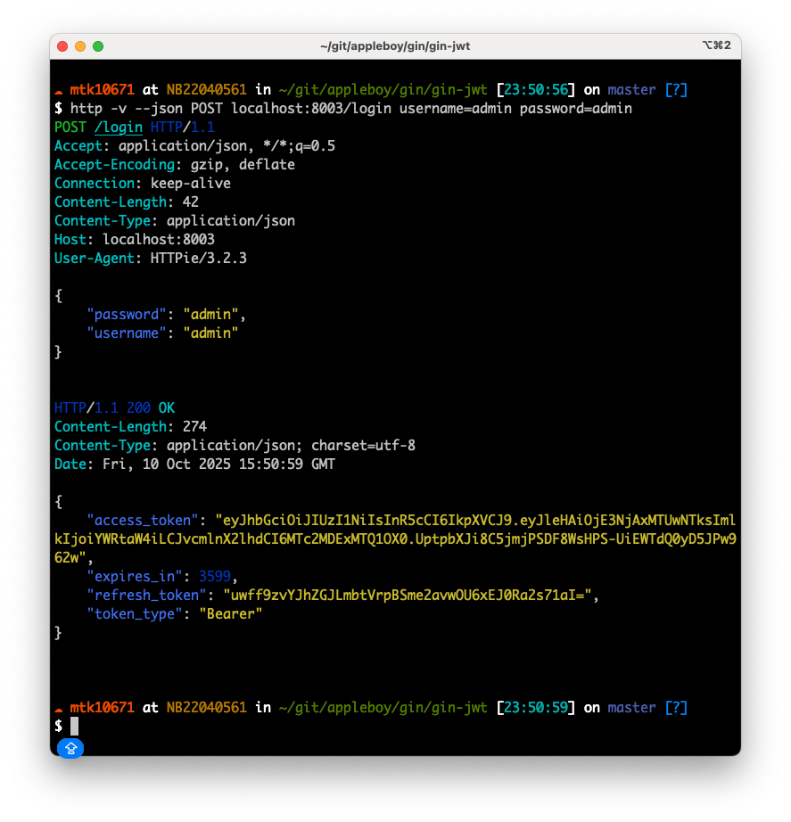
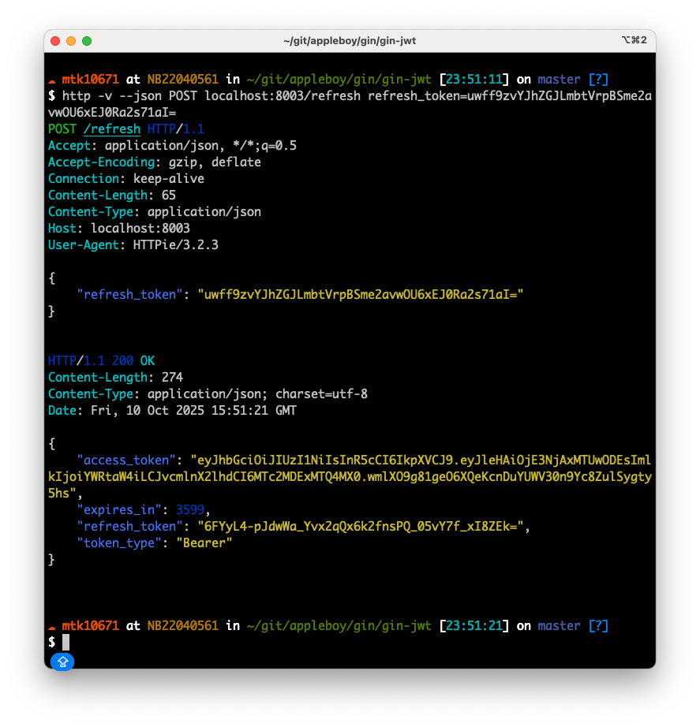

# Gin JWT 中介軟體

[English](README.md) | [繁體中文](README.zh-TW.md) | [简体中文](README.zh-CN.md)

[](https://github.com/appleboy/gin-jwt/actions/workflows/go.yml)
[](https://github.com/appleboy/gin-jwt/releases)
[](https://godoc.org/github.com/appleboy/gin-jwt)
[](https://goreportcard.com/report/github.com/appleboy/gin-jwt)
[](https://codecov.io/gh/appleboy/gin-jwt)
[](https://sourcegraph.com/github.com/appleboy/gin-jwt?badge)

一個強大且靈活的 [Gin](https://github.com/gin-gonic/gin) Web 框架的 JWT 驗證中介軟體，基於 [jwt-go](https://github.com/golang-jwt/jwt) 實作。  
輕鬆為你的 Gin 應用程式加入登入、Token 更新與授權功能。

---

## 目錄

- [Gin JWT 中介軟體](#gin-jwt-中介軟體)
  - [目錄](#目錄)
  - [功能特色](#功能特色)
  - [安全性注意事項](#安全性注意事項)
  - [安裝](#安裝)
    - [使用 Go Modules（推薦）](#使用-go-modules推薦)
  - [快速開始範例](#快速開始範例)
  - [Token 產生器（直接建立 Token）](#token-產生器直接建立-token)
    - [基本用法](#基本用法)
    - [Token 結構](#token-結構)
    - [刷新 Token 管理](#刷新-token-管理)
  - [Demo](#demo)
    - [登入](#登入)
    - [刷新 Token](#刷新-token)
    - [Hello World](#hello-world)
    - [授權範例](#授權範例)
    - [登出](#登出)
  - [Cookie Token](#cookie-token)
    - [登入流程（LoginHandler）](#登入流程loginhandler)
    - [需要 JWT Token 的端點（MiddlewareFunc）](#需要-jwt-token-的端點middlewarefunc)
    - [登出流程（LogoutHandler）](#登出流程logouthandler)
    - [刷新流程（RefreshHandler）](#刷新流程refreshhandler)
    - [登入失敗、Token 錯誤或權限不足](#登入失敗token-錯誤或權限不足)
  - [截圖](#截圖)
  - [授權](#授權)

---

## 功能特色

- 🔒 為 Gin 提供簡單的 JWT 驗證
- 🔁 內建登入、刷新、登出處理器
- 🛡️ 可自訂驗證、授權與 Claims
- 🍪 支援 Cookie 與 Header Token
- 📝 易於整合，API 清晰
- 🔐 符合 RFC 6749 規範的刷新 Token（OAuth 2.0 標準）
- 🗄️ 可插拔的刷新 Token 儲存（記憶體、Redis 等）
- 🏭 直接產生 Token，無需 HTTP 中介軟體
- 📦 結構化 Token 類型與中繼資料

---

## 安全性注意事項

> **警告：**
> 使用弱密碼（如短或簡單密碼）的 JWT Token 易受暴力破解攻擊。
> **建議：**請使用強且長的密鑰或 `RS256` Token。
> 詳見 [jwt-cracker repository](https://github.com/lmammino/jwt-cracker)。
> **OAuth 2.0 安全性：**
> 此函式庫預設遵循 RFC 6749 OAuth 2.0 標準，使用分離的不透明刷新 Token，
> 這些 Token 在伺服器端儲存並在每次使用時輪替。這比同時使用 JWT Token
> 作為存取與刷新用途提供更好的安全性。

---

## 安裝

### 使用 Go Modules（推薦）

```sh
export GO111MODULE=on
go get github.com/appleboy/gin-jwt/v2
```

```go
import "github.com/appleboy/gin-jwt/v2"
```

---

## 快速開始範例

請參考 [`_example/basic/server.go`](./_example/basic/server.go) 範例檔案，並可使用 `ExtractClaims` 取得 JWT 內的使用者資料。

```go
// ...（完整範例請見 _example/basic/server.go）
```

---

## Token 產生器（直接建立 Token）

新的 `GenerateTokenPair` 功能讓你可以直接建立 JWT Token 而無需 HTTP 中介軟體，非常適合程式化驗證、測試和自訂流程。

### 基本用法

```go
package main

import (
    "fmt"
    "log"
    "time"

    jwt "github.com/appleboy/gin-jwt/v2"
    gojwt "github.com/golang-jwt/jwt/v5"
)

func main() {
    // 初始化中介軟體
    authMiddleware, err := jwt.New(&jwt.GinJWTMiddleware{
        Realm:      "example zone",
        Key:        []byte("secret key"),
        Timeout:    time.Hour,
        MaxRefresh: time.Hour * 24,
        PayloadFunc: func(data interface{}) gojwt.MapClaims {
            return gojwt.MapClaims{
                "user_id": data,
            }
        },
    })
    if err != nil {
        log.Fatal("JWT Error:" + err.Error())
    }

    // 產生完整的 Token 組（存取 + 刷新 Token）
    userData := "user123"
    tokenPair, err := authMiddleware.GenerateTokenPair(userData)
    if err != nil {
        log.Fatal("Failed to generate token pair:", err)
    }

    fmt.Printf("Access Token: %s\n", tokenPair.AccessToken)
    fmt.Printf("Refresh Token: %s\n", tokenPair.RefreshToken)
    fmt.Printf("Expires In: %d seconds\n", tokenPair.ExpiresIn())
}
```

### Token 結構

`GenerateTokenPair` 方法回傳結構化的 `core.Token`：

```go
type Token struct {
    AccessToken  string `json:"access_token"`   // JWT 存取 Token
    TokenType    string `json:"token_type"`     // 總是 "Bearer"
    RefreshToken string `json:"refresh_token"`  // 不透明刷新 Token
    ExpiresAt    int64  `json:"expires_at"`     // Unix 時間戳
    CreatedAt    int64  `json:"created_at"`     // Unix 時間戳
}

// 輔助方法
func (t *Token) ExpiresIn() int64 // 回傳到期前的秒數
```

### 刷新 Token 管理

使用 `GenerateTokenPairWithRevocation` 來刷新 Token 並自動撤銷舊 Token：

```go
// 刷新並自動撤銷舊 Token
newTokenPair, err := authMiddleware.GenerateTokenPairWithRevocation(userData, oldRefreshToken)
if err != nil {
    log.Fatal("Failed to refresh token:", err)
}

// 舊刷新 Token 現在已失效
fmt.Printf("New Access Token: %s\n", newTokenPair.AccessToken)
fmt.Printf("New Refresh Token: %s\n", newTokenPair.RefreshToken)
```

**使用情境：**

- 🔧 **程式化驗證**：服務間通訊
- 🧪 **測試**：為測試驗證端點產生 Token
- 📝 **註冊流程**：使用者註冊後立即發放 Token
- ⚙️ **背景作業**：為自動化流程建立 Token
- 🎛️ **自訂驗證流程**：建立自訂驗證邏輯

詳見[完整範例](_example/token_generator/)。

---

## Demo

啟動範例伺服器：

```sh
go run _example/basic/server.go
```

建議安裝 [httpie](https://github.com/jkbrzt/httpie) 來測試 API。

### 登入

```sh
http -v --json POST localhost:8000/login username=admin password=admin
```



### 刷新 Token

使用符合 RFC 6749 規範的刷新 Token（預設行為）：

```sh
# 首先登入取得刷新 Token
http -v --json POST localhost:8000/login username=admin password=admin

# 使用刷新 Token 取得新的存取 Token（公開端點）
http -v --form POST localhost:8000/refresh refresh_token=your_refresh_token_here
```



### Hello World

以 `admin`/`admin` 登入後呼叫：

```sh
http -f GET localhost:8000/auth/hello "Authorization:Bearer xxxxxxxxx"  "Content-Type: application/json"
```

**回應：**

```json
{
  "text": "Hello World.",
  "userID": "admin"
}
```

### 授權範例

以 `test`/`test` 登入後呼叫：

```sh
http -f GET localhost:8000/auth/hello "Authorization:Bearer xxxxxxxxx"  "Content-Type: application/json"
```

**回應：**

```json
{
  "code": 403,
  "message": "You don't have permission to access."
}
```

### 登出

先登入取得 JWT Token，然後呼叫登出端點：

```sh
# 先登入取得 JWT Token
http -v --json POST localhost:8000/login username=admin password=admin

# 使用取得的 JWT Token 來登出（將 xxxxxxxxx 替換為實際的 Token）
http -f POST localhost:8000/auth/logout "Authorization:Bearer xxxxxxxxx" "Content-Type: application/json"
```

**回應：**

```json
{
  "code": 200,
  "logged_out_user": "admin",
  "message": "Successfully logged out",
  "user_info": "admin"
}
```

登出回應展示了 JWT 聲明現在可以透過 `jwt.ExtractClaims(c)` 在登出期間存取，讓開發者能夠取得使用者資訊用於日誌記錄、稽核或清理作業。

---

## Cookie Token

若要將 JWT 設定於 Cookie，請使用以下選項（參考 [MDN 文件](https://developer.mozilla.org/zh-TW/docs/Web/HTTP/Cookies#Secure_and_HttpOnly_cookies)）：

```go
SendCookie:       true,
SecureCookie:     false, // 非 HTTPS 開發環境
CookieHTTPOnly:   true,  // JS 無法修改
CookieDomain:     "localhost:8080",
CookieName:       "token", // 預設 jwt
TokenLookup:      "cookie:token",
CookieSameSite:   http.SameSiteDefaultMode, // SameSiteDefaultMode, SameSiteLaxMode, SameSiteStrictMode, SameSiteNoneMode
```

---

### 登入流程（LoginHandler）

- **內建：** `LoginHandler`  
  在登入端點呼叫此函式以觸發登入流程。

- **必須：** `Authenticator`  
  驗證 Gin context 內的使用者憑證。驗證成功後回傳要嵌入 JWT Token 的使用者資料（如帳號、角色等）。失敗則呼叫 `Unauthorized`。

- **可選：** `PayloadFunc`  
  將驗證通過的使用者資料轉為 `MapClaims`（map[string]interface{}），必須包含 `IdentityKey`（預設為 `"identity"`）。

- **可選：** `LoginResponse`  
  處理登入後邏輯，例如回傳 Token JSON。

---

### 需要 JWT Token 的端點（MiddlewareFunc）

- **內建：** `MiddlewareFunc`  
  用於需要 JWT 驗證的端點。會：

  - 從 header/cookie/query 解析 Token
  - 驗證 Token
  - 呼叫 `IdentityHandler` 與 `Authorizator`
  - 驗證失敗則呼叫 `Unauthorized`

- **可選：** `IdentityHandler`  
  從 JWT Claims 取得使用者身份。

- **可選：** `Authorizator`  
  檢查使用者是否有權限存取該端點。

---

### 登出流程（LogoutHandler）

- **內建：** `LogoutHandler`  
  用於登出端點。會清除 Cookie（若 `SendCookie` 設定為 true）並呼叫 `LogoutResponse`。

- **可選：** `LogoutResponse`  
  回傳登出結果的 HTTP 狀態碼。

---

### 刷新流程（RefreshHandler）

- **內建：** `RefreshHandler`  
  用於刷新 Token 端點。若 Token 在 `MaxRefreshTime` 內，會發新 Token 並呼叫 `RefreshResponse`。

- **可選：** `RefreshResponse`  
  回傳新 Token 的 JSON。

---

### 登入失敗、Token 錯誤或權限不足

- **可選：** `Unauthorized`  
  處理登入、授權或 Token 錯誤時的回應。回傳 HTTP 錯誤碼與訊息的 JSON。

---

## 截圖

| 登入                              | 刷新 Token                                |
| --------------------------------- | ----------------------------------------- |
|  |  |

---

## 授權

詳見 [`LICENSE`](LICENSE)。
